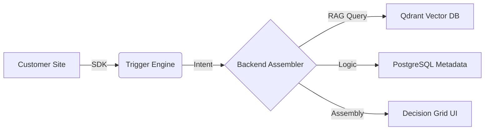

# 🛡️ Decision Assembly Platform (DAP)

> **Eliminating decision fatigue through context-aware information assembly.**

DAP is a "Zero-UI" virtual guide that lives inside existing websites (Banking, E-commerce, SaaS). It observes user behavior passively and interjects only when it detects "decision friction," assembling a dynamic grid of products and rationale to help users move forward with confidence.

---

## ✨ Core Features

*   **🕵️ Silent Virtual Guide**: A non-intrusive "Commentary Strip" that observes behavior (scrolls, dwells, hovers) without requiring chat input.
*   **⚡ Behavioral Triggers**: Smart detection of intent (e.g., "Multiple Product Views", "Hesitation", "Navigation Loops").
*   **🧩 Dynamic Grid Assembly**: RAG-powered (Retrieval-Augmented Generation) blocks that pull product data, comparisons, and eligibility criteria in real-time.
*   **🔍 Transparent Rationale**: Every recommendation includes a "Why This?" explanation derived from session context.
*   **🤖 Agentic Discovery**: Self-onboarding system that uses **Crawl4AI** and **LangGraph** to "understand" and index new websites automatically.

---

## 🏗️ System Architecture

DAP is built on a high-performance, asynchronous stack designed for sub-200ms latency:

-   **Backend**: 🐍 [FastAPI](https://fastapi.tiangolo.com/) (Python) + [Uvicorn](https://www.uvicorn.org/)
-   **AI Orchestration**: 🕸️ [LangGraph](https://www.langchain.com/langgraph) (Stateful Agentic Workflows)
-   **Vector Intelligence**: 🔍 [Qdrant](https://qdrant.tech/) (Vector Database)
-   **SDK (Client)**: 🛡️ [TypeScript](https://www.typescriptlang.org/) / Rollup (Zero-dependency Runtime)
-   **Crawler**: 🕷️ [Crawl4AI](https://github.com/unclecode/crawl4ai) (Markdown-optimized crawling)



---

## 📁 Repository Structure

-   `backend/`: FastAPI services, business logic, and the RAG assembly pipeline.
-   `banking-app/`: A reference implementation for financial decision support.
-   `sdk/`: The core TypeScript runtime that injects the DAP UI into host sites.
-   `docs/`: Deep-dive technical documentation (PRD, Architecture, WBS).
-   `test-sites/`: Sandbox environments for testing different industry verticals.

---

## 🚀 Quick Start

### 1. Backend Setup
```bash
pip install -r requirements.txt
python backend/main.py
```

### 2. Frontend/Apps
Navigate to `banking-app` or `ecommerce-website`:
```bash
npm install
npm run dev
```

### 3. SDK Integration
Add this to your website's `<head>`:
```html
<script src="https://dap-cdn.com/loader.js"></script>
<script>DecisionPlatform.init({ siteId: 'YOUR_SITE_ID' });</script>
```

---

## 📚 Documentation
For detailed insights, check out the [DAP Architecture Guide](docs/DAP_Project_Architecture.md) and the [Product Requirements Document](docs/DAP_PRD.md).
