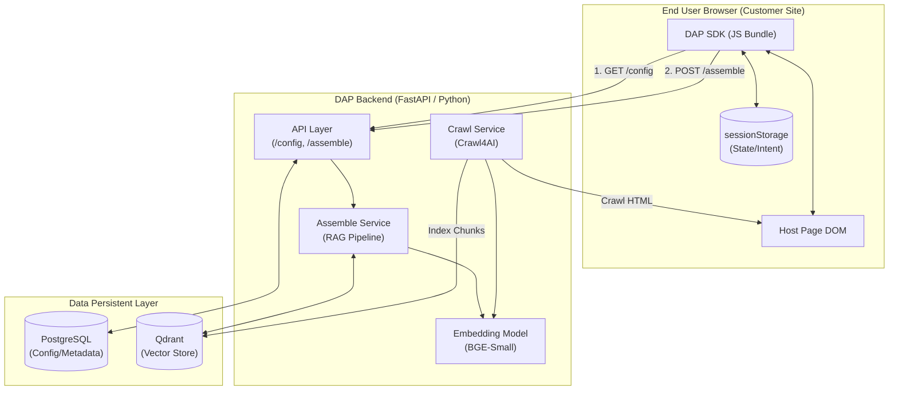
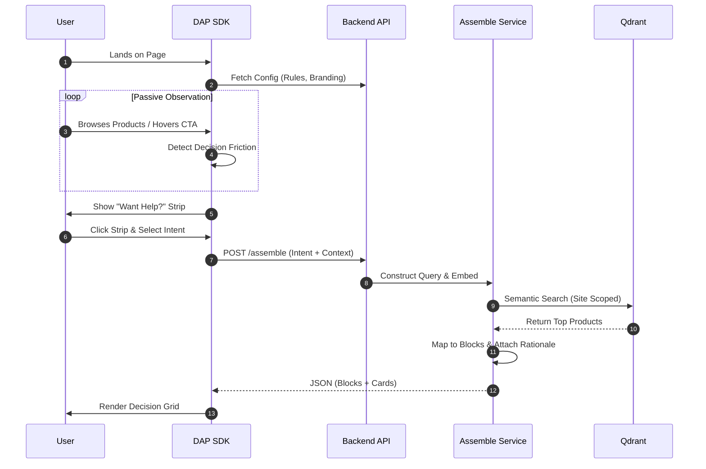
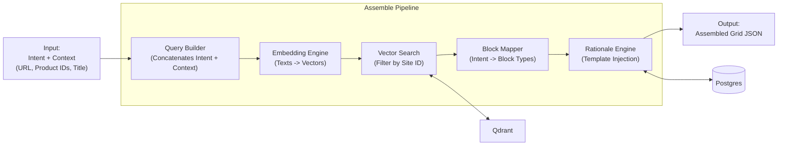
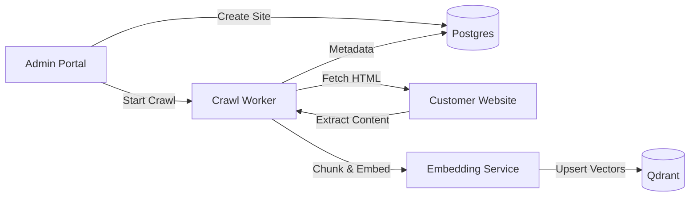

# DAP High-Level Architecture Flow

This document provides a high-level overview of the technical architecture and data flows for the Decision Assembly Platform (DAP).

## 1. System Blueprint

The following diagram illustrates the core components of the DAP ecosystem and their primary interactions.

---

## 2. End-to-End User Journey

This flow traces the path from a user landing on a customer's website to receiving a context-aware decision grid.

---

## 3. The "Assemble" (RAG) Architecture

A detailed look at the core RAG (Retrieval-Augmented Assembly) pipeline that powers the Decision Grid.

---

## 4. Administrative Flow (Onboarding)

How a customer website is integrated into the platform.

