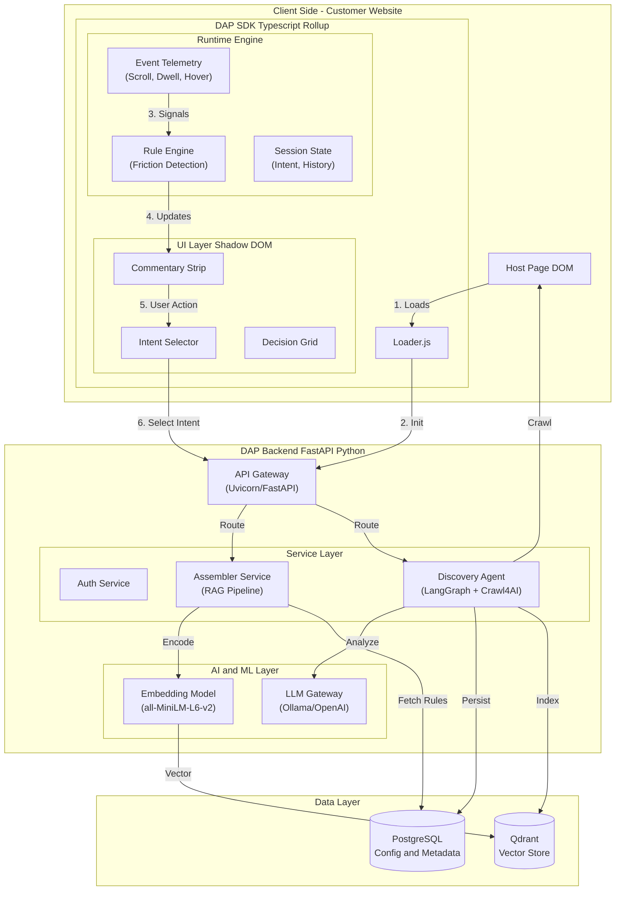

# Decision Assembly Platform (DAP) - Project Architecture

## 1. Executive Summary

**Product Name:** Decision Assembly Platform (DAP)
**Goal:** To eliminate decision fatigue on customer websites by identifying user intent (e.g., "Compare options", "Help me choose") and dynamically assembling a decision grid with relevant product information and rationale.

**Core Value Proposition:**
-   **Zero-UI Friction:** Integrated directly into the customer's website via a lightweight SDK.
-   **Intent-Driven:** Replaces generic search with intent-specific decision grids.
-   **Privacy-First:** Rule-based triggers and local session storage; no intrusive tracking.

---

## 2. System Architecture

The DAP system follows a **Client-Server** architecture with two distinct pipelines: a **Real-Time Assembly Pipeline** for user interaction, and an **Agentic Discovery Pipeline** for site onboarding.

### High-Level Data Flow

1.  **SDK (Client)**: Installs on the customer's site. Tracks user behavior (scrolls, dwells, hovers) to detect "decision friction".
2.  **Trigger Engine**: When friction is detected (e.g., viewing 3 similar products), the SDK offers help via a **Commentary Strip**.
3.  **Assembler (Backend)**: If the user selects an intent, the SDK requests an "assembly". The Backend queries the **Vector Database** and uses **Rule-Based Logic** to assemble the grid.
4.  **Discovery (Agentic)**: For onboarding new sites, a **LangGraph-based Agent** crawls the site, analyzes the structure using LLMs, and auto-configures the system.

---

## 3. Technology Stack

### A. Backend (Core & Services)
-   **Framework:** **FastAPI** (Python 3.11+). Used for its speed and async pattern support.
-   **Server:** **Uvicorn** (ASGI implementation).
-   **Orchestration:** **LangGraph**.
    -   *Why:* Used in the `UniversalDAG` service to manage the stateful workflow of crawling, analyzing, and saving site configurations. It allows for "Agentic" behavior during site discovery.
-   **Crawling:** **Crawl4AI**.
    -   *Why:* Converts complex websites into clean Markdown that LLMs can easily analyze.

### B. Database & AI
-   **Vector Logic:** **Qdrant**.
    -   *Why:* Stores product embeddings for semantic search. Fast and scalable.
-   **Embeddings:** **Sentence-Transformers** (e.g., `all-MiniLM-L6-v2`).
    -   *Why:* Runs locally/cheaply to convert product text into vectors for RAG.
-   **Primary Database:** **PostgreSQL** (`asyncpg`).
    -   *Why:* Stores site configs, trigger rules, and content metadata.
-   **LLMs (Discovery Phase only):** **OpenAI / Ollama**.
    -   *Why:* Used to analyze crawled content to "understand" the site structure (finding CSS selectors for prices, buttons, etc.) and generate rationale templates.

### C. Frontend (SDK)
-   **Runtime:** **Vanilla JavaScript (TypeScript source)**.
    -   *Why:* Zero dependencies on the client. Ensures no conflicts with React/Vue/Angular on the host site.
-   **Bundler:** **Rollup**. Creates a tiny, optimized bundle.
-   **Styling:** **Scoped CSS**. Uses unique namespaces to ensure the DAP UI looks consistent regardless of the host site's CSS.

---

## 4. Key Component Deep Dive

### 1. The Real-Time Assembler (`services/assemble.py`)
This service handles the live user requests. It does **not** use LLMs to ensure <200ms latency.
-   **Section Detection:** Strictly identifies the current category (e.g., "Cardiology", "Laptops") to prevent irrelevant cross-domain results.
-   **Context Priority:** Prioritizes products the user *just saw* (History Lock) or is *currently viewing* (Section Lock) over generic search results.
-   **Block Mapping:** deterministically maps Intents (e.g., "Compare") to UI Blocks (e.g., "Comparison Table").

### 2. The Discovery Agent (`services/dag.py`)
This is the "AI Admin" that sets up the system.
-   **Step 1 (Crawl):** Uses `Crawl4AI` to fetch the homepage.
-   **Step 2 (Analyze):** Passes the Markdown to an LLM (via **LangGraph**) to identify:
    -   "What is a product page?" (URL RegEx).
    -   "Where is the price?" (CSS Selector).
    -   "What rationale makes sense here?" (Copywriting).
-   **Step 3 (Save):** Writes this config to PostgreSQL, automating the onboarding process.

### 3. The SDK Telemetry (`sdk/src/runtime`)
-   **Friction Detection:** Monitors user actions. e.g., if a user hovers a "Apply Now" button 3 times but doesn't click, it triggers a "Help me choose" prompt.
-   **Local State:** Uses `sessionStorage` to keep track of the user's intent and grid state across page reloads.

---

## 5. Security & Deployment
-   **Infrastructure:** Dockerized services for easy deployment.
-   **Data Isolation:** Strict Multi-Tenancy. Each site's data (vectors and config) is isolated.
-   **Privacy:** No PII is stored. Behavior is analyzed anonymously within the session.
