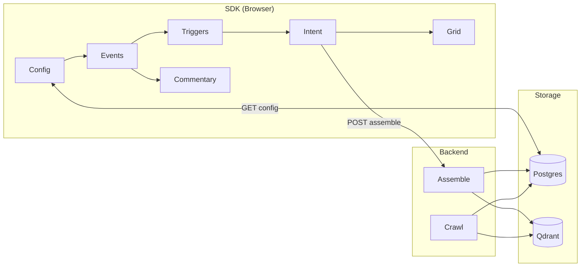
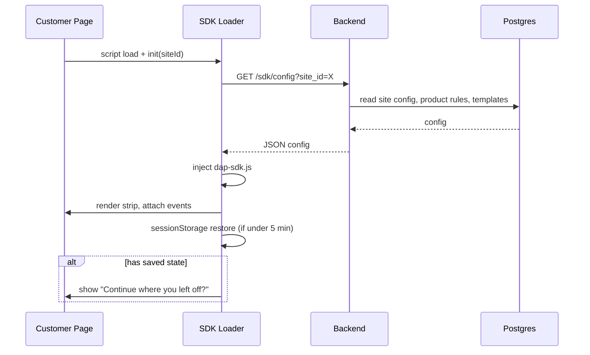
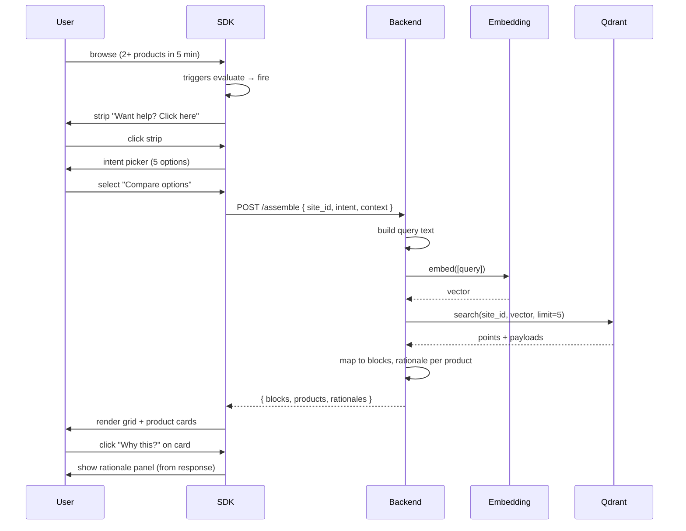
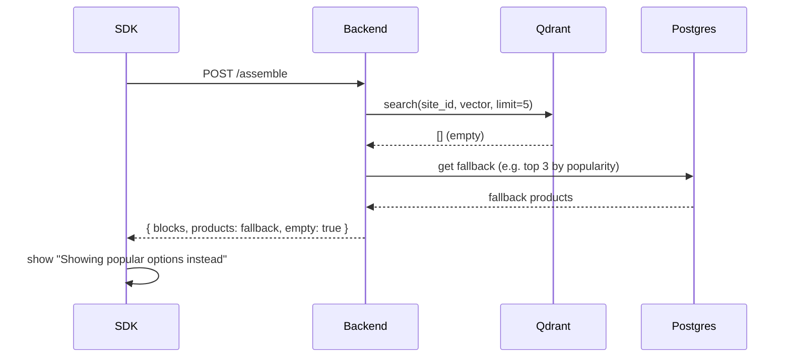
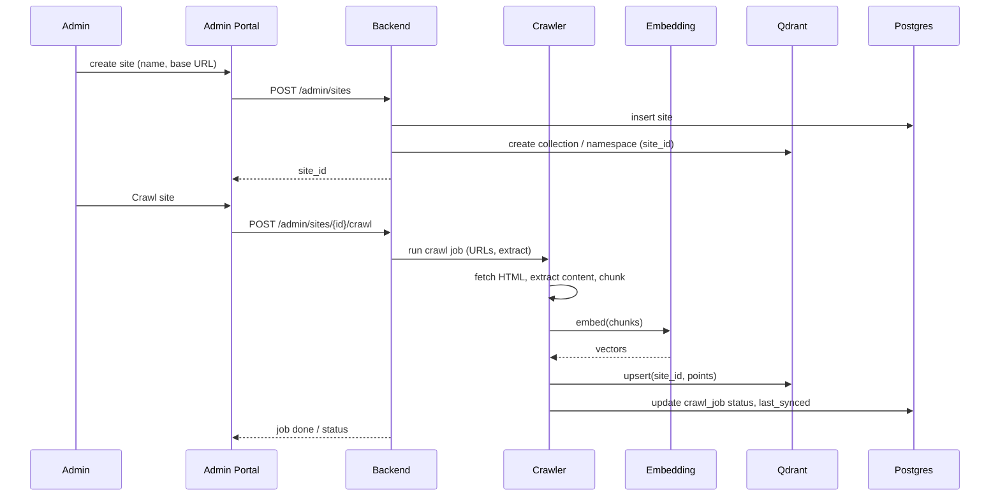
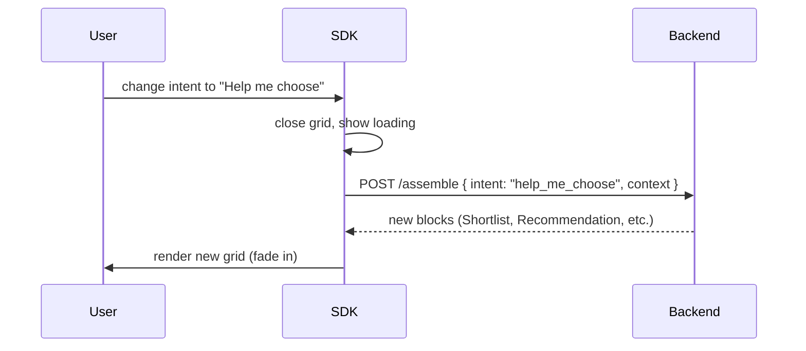

# Technical Architecture Document (TAD)
## Decision Assembly Platform (DAP)

**Document Version:** 1.2  
**Last Updated:** February 14, 2026  
**Status:** Draft  
**Alignment:** DAP_PRD.md v1.2 (Logical UX & Assembly Rules Integrated)

---

## Table of Contents

1. [Introduction and Overview](#1-introduction-and-overview)
2. [Key Concepts to Understand](#2-key-concepts-to-understand)
3. [Implementation Order](#3-implementation-order)
4. [System Architecture Overview](#4-system-architecture-overview)
5. [Component Architecture](#5-component-architecture)
6. [Module Breakdown](#6-module-breakdown)
7. [Overall Technical Flows](#7-overall-technical-flows)
8. [Data Flow Diagrams](#8-data-flow-diagrams)
   - 8.4 End-to-End Flows (ASCII) — How Different Flows Work Across Any Product Site
9. [Sequence Diagrams](#9-sequence-diagrams)
10. [Integration Architecture](#10-integration-architecture)
11. [Database Schema](#11-database-schema)
12. [API Endpoints](#12-api-endpoints)
13. [Tech Stack Finalization](#13-tech-stack-finalization)
14. [Granular Architecture Breakdown](#14-granular-architecture-breakdown)
15. [Edge Cases](#15-edge-cases)
16. [Error Handling & Fail-safes](#16-error-handling--fail-safes)
17. [Dependency List](#17-dependency-list)
18. [Testing Blueprint](#18-testing-blueprint)
19. [Deployment Blueprint](#19-deployment-blueprint)

---

## 1. Introduction and Overview

### 1.1 What This Document Is

This Technical Architecture Document (TAD) describes **how** to build the Decision Assembly Platform (DAP). It is written for developers who will implement the product. It defines components, technologies, data flows, APIs, and implementation steps so that the system can be built without ambiguity.

### 1.2 What the Product Is

DAP is a **website-embedded decision guide** that:

- Runs on **customer websites** via a small JavaScript SDK (two-line install).
- Shows a **commentary strip** at the bottom that describes what the user is doing in plain English.
- Uses **rule-based triggers** (no ML in v1) to detect decision friction (e.g. multiple product views, long dwell, CTA hover without click).
- When a trigger fires, the user **chooses an intent** (e.g. “Compare options”, “Help me choose”). Intent is **always selected by the user**, not predicted.
- The system **assembles a grid** of relevant products/information using **RAG over a vector store** (Qdrant), using only website content that has been crawled and indexed.
- Each product card can show **rationale** (“Why this?”) using **template-based** text plus context (no LLM required in v1).
- An **Admin Portal** lets site owners onboard their website (crawl → extract → index into Qdrant), configure triggers, product pages, and white-labeling.

### 1.3 Purpose of This Document

- Give a **single source of truth** for technical design.
- Enable **junior developers** to understand and implement features without guessing.
- Ensure **alignment with the PRD** (functional and non-functional requirements).
- Define **open-source, permissive-license** choices only; use **Docker, Qdrant, PostgreSQL** (and optionally **Ollama**) where already available on the office server.
- Clarify **what to build first** and in what order (implementation order).
- Document **edge cases and error handling** so behaviour is consistent and robust.

### 1.4 Out of Scope for This TAD

- Detailed UI/UX mockups (covered at high level; details in PRD).
- Marketing or business strategy.
- v2 features (e.g. ML-based intent prediction, conversational AI).

### 1.5 Site Compatibility (Including Drupal)

**Yes — DAP fits any site that can load two lines of JavaScript.** It is **CMS-agnostic**: Drupal, WordPress, custom React, Shopify, or static HTML. The SDK runs in the browser; it does not care how the page was built. The customer adds the script tag and `DecisionPlatform.init({ siteId: "..." })`; the strip appears and events are tracked.

**Product details from “any site”:** Quality of product data depends on **extraction strategy** at crawl time:

| Approach | What it does | Best for |
|----------|--------------|----------|
| **Generic crawl** | Fetch HTML, extract visible text and links, chunk and embed. | Any site; product “details” are whatever text is on the page (title, description, etc.). |
| **Schema.org / structured data** | If the site emits Product schema (JSON-LD or microdata), parse it and use name, description, price, etc. | Sites that already mark up products (many Drupal/WordPress modules do). **Prefer this when available** — most accurate. |
| **Admin-configured selectors** | Admin defines CSS selectors or XPaths for product title, price, description, etc. (e.g. `.product-title`, `[data-product-price]`). Crawler uses these per site. | Custom or non-standard themes; same DAP codebase, different config per site. |
| **CMS-specific extractors (optional)** | Optional modules for Drupal (e.g. Commerce product nodes), WooCommerce, etc., that know that CMS’s DOM or API. | Best product detail quality per CMS; more build and maintenance. |

**Recommendation:** Implement **generic crawl + Schema.org parsing** first (works on Drupal, WordPress, and any site with Product markup). Add **admin-configured selectors** in config so admins can tune extraction per site. Add CMS-specific extractors later if needed for “proper” product details on specific platforms.

### 1.6 Experience When Intent Is Identified

**What the user sees and what the system “tells” them:**

1. **Before intent:** The **commentary strip** (bottom of page) shows a short, template-based line in plain English, e.g.:
   - “You’ve viewed 2 products in 3 minutes — comparing options?”
   - “Spent 45 seconds on pricing — need more info?”
   - “Hovered over Apply Now — want help choosing?”
   The strip is **always visible**; it does not “identify intent” by itself — it **suggests** that help is available and invites a click.

2. **User clicks strip:** A **modal opens** with **5 intent options** (user chooses; we do not predict):
   - Help me choose  
   - Compare options  
   - Check eligibility  
   - Understand differences  
   - Just exploring  

3. **After user selects an intent:** The system **assembles the experience**:
   - **Strip** can update to something like: “Found 4 options for your comparison — here’s why each fits.”
   - A **Decision Canvas (grid)** appears with:
     - **Blocks** per intent (e.g. for “Compare options”: Comparison, Costs, Benefits, Limitations).
     - **Product cards** (name, features, price, eligibility) from RAG over the crawled site content.
     - **“Why this?”** on each card: clicking opens a **rationale panel** with template-based text, e.g. “You viewed 2 similar products → this matches your comparison.”
   - User can **reorder blocks**, **expand/collapse**, **remove** blocks; state can persist in sessionStorage.

**In short:** When intent is “identified” (by the **user selecting** it), we **tell** them via the strip copy and the grid title/message; the **experience** is the assembled grid + product cards + rationale, not a chat or a single sentence — the **grid and rationale are the product**.

---

## 2. Key Concepts to Understand

Before implementing, developers must understand these concepts and how DAP uses them.

### 2.1 Multi-Tenancy (Sites)

- **Tenant = one customer site.** Each site has a unique `site_id` (UUID or slug).
- **Isolation:** All data (config, vectors, crawl state) is keyed by `site_id`. Qdrant uses **named collections per site** (e.g. `dap_<site_id>`) or a single collection with **payload filter** `site_id = X`.
- **Why:** PRD requires per-site isolation and no cross-site learning.

### 2.2 Product Page Detection

- **Only “product” pages** count for triggers like “multiple product views.” Other pages (e.g. /about, /contact) do not.
- **How:** Admin configures **product page rules** per site: URL patterns (e.g. `/products/*`, `/cards/*`) and/or DOM selectors (e.g. `[data-product-id]`). Backend exposes these to the SDK via config API.
- **SDK:** Before incrementing “products viewed” or firing product-based triggers, SDK checks current URL/DOM against these rules (e.g. match pathname against patterns, or run selector).
- **Product ID source (clinical):** Admin configures how SDK derives `product_id` for the event buffer and for assemble context: e.g. URL path segment, `[data-product-id]` (or configurable attribute), or meta tag. Config key e.g. `product_id_source` in product_page_rules; SDK uses same source consistently.
- **CTA selector (clinical):** Admin configures **cta_selectors** (array of CSS selectors). SDK attaches hover listeners only to these elements; only hovers on these count toward CTA hover trigger.
- **"Help me choose" selector (clinical):** Admin may set **help_me_choose_selector** (single selector). When user clicks that element, SDK fires **explicit trigger** immediately (no other rules). If unset, explicit trigger is only from strip click.
- **Page title in context:** SDK MUST send **page_title** in assemble context (e.g. `document.title` or configurable selector). Backend uses it for RAG query construction.
- **Event buffer reset on session timeout:** When session times out (session_timeout_min), SDK MUST clear event buffer (product views, dwell, CTA hovers, revisit counts) so triggers re-evaluate from scratch.

### 2.3 Rule-Based Triggers (No ML in v1)

- **Triggers are deterministic rules.** Examples: “distinct product pages viewed ≥ 2 in 5 min,” “dwell time ≥ 45s and no CTA click,” “CTA hover ≥ 2 and no click,” “same page revisited ≥ 2 in 3 min,” “explicit Help me choose click.”
- **Priority when multiple fire:** Explicit > Multiple Product Views > CTA Hover > Hesitation > Navigation Loops. Only the highest-priority trigger is used; others are logged.
- **Cooldowns:** After trigger fires (30s), after user dismisses intent menu (60s), after grid closes (45s). No cooldown after user selects intent. Dismissal count: if user dismisses 2+ times in session, suppress further triggers for that session.
- **Implementation:** SDK holds in-memory state (event counts, timestamps, product set). Rules run in SDK; no server call to “evaluate trigger.”

**Event catalog and buffer (PRD §7.2.1–7.2.2):** Events E1–E8 (page_view, product_view, dwell_update, scroll_depth, cta_hover, cta_click, same_page_revisit, explicit_help_click). Buffer: distinct_product_ids, product_first_ts/product_last_ts, current_page_dwell_sec, scroll_depth_pct, cta_hover_count, cta_clicked, same_page_revisit_count, last_activity_ts, dismissal_count, cooldown_until_ts. Reset on session timeout.

**Trigger evaluation (PRD §7.2.3–7.2.4):** (1) Gate: dismissal_count < 2 and now >= cooldown_until_ts. (2) Evaluate each trigger condition with config thresholds. (3) Winner = highest priority among true (Explicit=1, Multiple Products=2, CTA Hover=3, Hesitation=4, Loops=5). (4) Show strip CTA; set cooldown. (5) On dismiss: cooldown_after_dismiss_sec, dismissal_count += 1. On grid close: cooldown_after_grid_close_sec. No intent scoring; user always selects intent.

**Business and scoring logic (PRD §7.2.5):** All thresholds in trigger_thresholds (site_config). No scoring for intent selection. RAG uses vector similarity for assembly only.

### 2.4 Intent and Block Mapping

- **Intent is always user-selected** (one of: Help me choose, Compare options, Check eligibility, Understand differences, Just exploring).
- **Block mapping is fixed per intent** (see PRD §7.6). Example: “Compare options” → Comparison, Costs, Benefits, Limitations. Backend returns which blocks to show; SDK renders them. No ML.

### 2.5 RAG (Retrieval-Augmented Assembly)

- **Flow:** User selects intent + SDK has context (current URL, product IDs viewed, optional scroll/dwell). SDK sends **context + intent** to backend. Backend builds a **query** (e.g. concatenate intent label + page title + product names), **embeds** it with the same model used at index time, **searches Qdrant** (filter by `site_id`, limit 5–10). Results are **product/content chunks**; backend maps them to **blocks** (e.g. product cards, comparison rows) and returns JSON.
- **No LLM in v1:** Assembly is rule-based (intent → block types, relevance = vector similarity). Rationale is **template-based** with context injection (e.g. “You viewed {N} products → this matches your comparison”).

**RAG clinical logic (see also §6.1 assemble):** Query when only product_ids: backend builds query from intent label + product identifiers (resolve titles from Qdrant if needed); never send empty query. **Intent-based product set (PRD §7.6.1):** For intents **compare_options** and **understand_differences**, the product set MUST be restricted to **only** products whose `product_id` is in `context.product_ids` (filter by product_id in Qdrant; no semantic search to add others). For help_me_choose and just_exploring, use semantic search (top N). For check_eligibility, use product_ids if non-empty, else semantic search. "Popular" fallback: top N by most recently indexed (indexed_at); alternative: admin-configured featured IDs. Do **not** use popular fallback for Compare/Understand when user's product_ids are missing — return subset found and message, or empty with clear copy. Payload → block/card: one canonical mapping (title, url, price, features, eligibility, product_id) to product card per intent→block. Empty block pull: POST /assemble with block_type or pull_query returns content for that block only. Rationale template variables: `{n}`, `{intent}`, `{product_title}`, `{product_id}`, `{page_title}`, `{url}`; optional `{dwell_sec}`, `{cta_hover_count}`; if missing use generic rationale.

### 2.6 Embeddings and Vector Store

- **Embedding model:** One model for both indexing (crawl output) and query (user context + intent). Use a **single, small, open-source** model; recommended **BAAI/bge-small-en-v1.5** (384-dim, MIT, better retrieval than MiniLM). See §13.6 for alternatives (Arctic-Embed, E5). No GPU required.
- **Qdrant:** One collection per site (recommended). Points follow a **consistent payload schema** (site_id, type, url, product_id, title, content, chunk_id, and optional price, features, category) so RAG works across different sites and domains. See §11.4.

### 2.7 Session and State

- **Session = one browser tab.** Session resets after 30 min idle, full page reload, or (for SPAs) major route change. Session timeout and “restore within 5 min” window are configurable per site.
- **State in SDK:** Intent, grid open/closed, block order, expanded/collapsed, removed block IDs. Persist in **sessionStorage** keyed by `site_id` so multiple tabs stay independent.
- **Restore on reload:** If last activity &lt; 5 min, SDK reads sessionStorage and can show “Continue where you left off?” and restore grid/intent.

### 2.8 Commentary Strip

- **Content:** Short English sentences derived from **templates** + variables (e.g. “You’ve viewed {n} products in {m} minutes,” “Spent {t} seconds on pricing”). Templates are configurable per site (admin).
- **Updates:** Driven by same events that feed triggers (page view, product view, dwell, hover). Updates must be **throttled** (e.g. debounce 500ms, max one update per 2s) so the strip doesn’t flicker.

### 2.9 Two-Line Install (SDK)

- **Line 1:** Load script from your backend/CDN, e.g. `https://<api-host>/sdk/loader.js`.
- **Line 2:** `DecisionPlatform.init({ siteId: "..." });`
- **Loader:** Fetches a small runtime bundle (or inline config + bootstrap), injects the strip, registers event listeners, and optionally fetches site config (product page rules, commentary templates, trigger thresholds). No build step on the customer site.

---

## 3. Implementation Order

Build in this order to respect dependencies and get a working slice early.

| Phase | What to Build | Why This Order |
|-------|----------------|----------------|
| **1. Foundation** | Postgres schema (sites, config, crawl_jobs, product_page_rules). Qdrant: create collection(s) and indexing API. Embedding service (e.g. sentence-transformers) + “embed text” and “index chunk” helpers. | All other features depend on storage and vectors. |
| **2. Crawl & Index** | Crawl job (per site): fetch URLs (sitemap or seed list), extract product/page content, chunk, embed, upsert into Qdrant. Use Crawl4AI or Playwright + BeautifulSoup; store raw content or chunks in Postgres if needed for re-index. | Admin onboarding (FR-026–028) and RAG need indexed content. |
| **3. Backend API (Core)** | Site config API (product page rules, trigger thresholds, commentary templates, block mapping). Session not required for anonymous end-users. Auth for Admin only. | SDK and Admin need config; RAG needs a single “assemble” endpoint. |
| **4. RAG & Assembly** | One “assemble” endpoint: input = site_id, intent, context (url, product_ids, etc.). Build query text → embed → search Qdrant → map to block types (intent→block mapping) → return JSON (blocks + product cards + rationale templates). Handle empty results (fallback to “popular” if configured) and timeouts (e.g. 200ms). | Grid and “Why this?” depend on this. |
| **5. SDK (Strip + Events)** | Minimal bundle: init(siteId), render strip (fixed bottom), fetch config, start event listeners (history, click, scroll, hover). Event buffer: product views, dwell, CTA hovers. Throttled commentary updates. | Strip and event collection are the visible core. |
| **6. SDK (Triggers + Intent)** | Trigger rules engine (in-SDK), priority and cooldowns, dismissal count. On trigger: show strip CTA (“Want help?”). On click: show intent picker (5 options). On select: call assemble API, receive blocks. | Unblocks “grid assembly” flow. |
| **7. SDK (Grid + Rationale)** | Render grid from assemble response (blocks + cards). “Why this?” opens rationale panel; backend returns template key + variables; SDK renders template or fallback. | Completes main user journey. |
| **8. Admin Portal** | Site CRUD, website onboarding (submit URL → create crawl job), product page rules UI, trigger/config UI, content list (indexed pages), re-sync, white-label (branding). | Required for FR-026–033. |
| **9. SDK (Block UX)** | Block drag-and-drop (reorder), expand/collapse, remove; persist order/state in sessionStorage; restore on reload &lt; 5 min. | FR-036–040. |
| **10. Empty Blocks & Custom Query** | Empty blocks: prompts + quick-select chips; on click, call assemble (or a “pull content” API) and fill block. Custom Query block: structured query form → same RAG endpoint with query params → show results in block. | FR-041–049. |

**Suggested timeline (high level):** Phase 1–2 (1–2 weeks), Phase 3–4 (1 week), Phase 5–7 (1.5–2 weeks), Phase 8 (1–2 weeks), Phase 9–10 (1 week). Adjust by team size.

---

## 4. System Architecture Overview

### 4.1 High-Level Components

- **Customer website:** Hosts the page; includes DAP via two-line script. **DAP SDK** runs in the browser: strip, events, triggers, intent picker, grid, rationale.
- **DAP Backend:** Serves SDK assets, site config, and **assemble** (RAG) API. Runs crawl jobs, embeds content, and writes to Qdrant and Postgres.
- **Admin Portal:** Web app for site owners: onboarding, config, product rules, trigger settings, white-label, content list.
- **PostgreSQL:** Sites, config, product page rules, crawl jobs, crawl state (optional), and any “popular products” or fallback data.
- **Qdrant:** Vector store per site; holds embedded chunks for RAG. Used only by backend.

### 4.2 High-Level Architecture (ASCII)

```
┌─────────────────────────────────────────────────────────────────────────────┐
│                        CUSTOMER WEBSITE (their domain)                       │
│  ┌─────────────────────────────────────────────────────────────────────┐   │
│  │  Page content (products, etc.)                                       │   │
│  │  + <script src="https://api.dap.example/sdk/loader.js">              │   │
│  │  + DecisionPlatform.init({ siteId: "abc" });                          │   │
│  │  → DAP SDK: strip, events, triggers, intent, grid, rationale          │   │
│  └─────────────────────────────────────────────────────────────────────┘   │
└─────────────────────────────────────────────────────────────────────────────┘
                    │ config (product rules, templates)
                    │ assemble (context + intent → blocks)
                    ▼
┌─────────────────────────────────────────────────────────────────────────────┐
│                          DAP BACKEND (your server)                           │
│  ┌──────────────┐  ┌──────────────┐  ┌──────────────┐  ┌──────────────────┐ │
│  │ Config API   │  │ Assemble API │  │ Crawl/Index  │  │ SDK asset server │ │
│  │ (site rules, │  │ (RAG: embed  │  │ (crawl site, │  │ (loader.js, etc.)│ │
│  │  triggers)   │  │  query, Qdrant│  │  embed,      │  │                  │ │
│  │              │  │  → blocks)   │  │  Qdrant)     │  │                  │ │
│  └──────┬───────┘  └──────┬───────┘  └──────┬───────┘  └──────────────────┘ │
│         │                  │                  │                               │
└─────────┼──────────────────┼──────────────────┼─────────────────────────────┘
          │                  │                  │
          ▼                  ▼                  ▼
┌─────────────────┐  ┌─────────────────┐  ┌─────────────────┐
│   PostgreSQL    │  │     Qdrant      │  │  Embedding      │
│   sites,       │  │   vectors       │  │  (e.g. sentence-│
│   config,      │  │   per site      │  │  transformers)  │
│   crawl_jobs   │  │                 │  │  same server    │
└─────────────────┘  └─────────────────┘  └─────────────────┘

┌─────────────────────────────────────────────────────────────────────────────┐
│  ADMIN PORTAL (React app, same backend or separate host)                    │
│  → Site CRUD, onboarding (URL → crawl), product rules, triggers,           │
│    content list, re-sync, white-label. Calls Backend APIs.                   │
└─────────────────────────────────────────────────────────────────────────────┘
```

### 4.3 Data Flow Summary

1. **End-user visits customer site** → SDK loads, fetches config (product rules, thresholds, templates).
2. **User browses** → SDK records events (product views, dwell, hovers) and updates commentary (throttled).
3. **Trigger fires** → SDK shows “Want help?”; user clicks → intent picker; user selects intent → SDK calls **Assemble API** with context + intent.
4. **Backend** builds query from context + intent → embeds → searches Qdrant (by site_id) → builds block list + product cards + rationale data → returns JSON.
5. **SDK** renders grid and rationale; user can reorder/expand/remove blocks; state in sessionStorage.
6. **Admin** creates site, sets URL → backend runs crawl → extracts content → embeds → upserts Qdrant; Admin edits product rules and config via Backend APIs.

### 4.4 Technology Choices (Concise)

| Concern | Choice | Rationale |
|--------|--------|-----------|
| **Vector DB** | Qdrant | Already in office; open source; good filtering and performance. |
| **Relational DB** | PostgreSQL | Already in office; stores sites, config, jobs. |
| **Embeddings** | BAAI/bge-small-en-v1.5 (or Arctic-Embed-s / E5-small) | 384-dim, permissive license; better retrieval than MiniLM; same model for index and query. §13.6. |
| **Backend** | FastAPI (Python) | Async, simple RAG pipeline, easy Qdrant/Postgres clients. |
| **Crawler** | Crawl4AI or Playwright + BeautifulSoup | PRD mentions Crawl4AI; open source; good for HTML extraction. |
| **SDK** | Vanilla JS (or small bundle with Rollup/esbuild) | Must be two-line install; minimal deps; no React on customer page. |
| **Admin UI** | React + Vite + TypeScript | Standard SPA; consumes Backend APIs. |
| **LLM** | Not used in v1 | Triggers and rationale are rule- and template-based. |

---

---

## 5. Component Architecture

### 5.1 Frontend (Two Surfaces)

**A. DAP SDK (customer website)**

| Layer | Tech | Purpose |
|-------|------|--------|
| Loader | Vanilla JS, single file | Fetch config, inject runtime, bootstrap strip. |
| Runtime | Vanilla JS (bundle with Rollup/esbuild) | Strip DOM, event listeners, trigger engine, intent UI, grid renderer, sessionStorage. |
| Styling | Scoped CSS (one namespace, e.g. `.dap-*`) | Strip, intent modal, grid, rationale panel; overridable via white-label. |
| No framework | No React/Vue on customer page | Keeps bundle small and avoids conflicts with host site. |

**Build:** One UMD/IIFE bundle (e.g. `dap-sdk.js`) + optional `loader.js` that fetches it. Output: single script customer drops in.

**B. Admin Portal**

| Layer | Tech | Purpose |
|-------|------|--------|
| App | React 18 + TypeScript + Vite | SPA for site CRUD, onboarding, config, content list. |
| UI | Tailwind CSS + headless components (e.g. Radix) or minimal custom | Forms, tables, modals; white-label preview. |
| State | React state + fetch (or TanStack Query for cache) | No global store required for v1. |
| Auth | JWT or session cookie from Backend | Login, protect all Admin routes. |

**Build:** `vite build` → static assets; served by same Backend or separate host.

### 5.2 Backend

| Layer | Tech | Purpose |
|-------|------|--------|
| API | FastAPI (Python 3.11+) | Config API, Assemble API, SDK asset serving, Admin CRUD. |
| DB client | asyncpg or SQLAlchemy 2 async | Postgres: sites, config, crawl jobs, product_page_rules. |
| Vector client | qdrant-client | Search/upsert; filter by site_id. |
| Embedding | BAAI/bge-small-en-v1.5 (sentence-transformers) | Same model for crawl index and query embed; in-process; better retrieval than MiniLM. §13.6. |
| Crawl | Crawl4AI or Playwright + BeautifulSoup | Fetch HTML, extract product/page content, chunk. |
| Auth | JWT (e.g. python-jose) or session middleware | Admin only; SDK endpoints public (site_id in query/body). |

**Structure:** Routers for `/config`, `/assemble`, `/sdk/*`, `/admin/*`; one embedding service module; one crawl job runner (sync or background task).

### 5.3 AI / Embedding (No LLM in v1)

| Concern | Tech | Usage |
|---------|------|--------|
| Text → vector | sentence-transformers `SentenceTransformer("all-MiniLM-L6-v2")` | Index: chunk text → embed → upsert Qdrant. Query: (intent + context) → embed → search. |
| Model load | Once at app start or lazy on first request | Cache model in process; ~80MB RAM. |
| Rationale | Templates in DB or config (e.g. "You viewed {n} products → this matches your comparison") | Backend fills variables from context; returns string or template key + vars to SDK. No LLM. |

### 5.4 APIs (Summary)

| API | Consumers | Purpose |
|-----|------------|---------|
| GET /sdk/config?site_id= | SDK | Product page rules, trigger thresholds, commentary templates, white-label. |
| POST /assemble | SDK | Body: site_id, intent, context (url, product_ids, etc.). Response: blocks, product cards, rationale data. |
| GET /sdk/loader.js, /sdk/dap-sdk.js | Customer page | Static SDK assets. |
| Admin: sites, config, crawl, product rules, content list | Admin Portal | CRUD; trigger crawl job; re-sync. |

---

## 6. Module Breakdown

### 6.1 Backend Modules

| Module | Responsibility | Depends on |
|--------|----------------|------------|
| **sites** | Site CRUD, site_id validation. | Postgres. |
| **config** | Product page rules, trigger thresholds, commentary templates, block mapping, white-label. Read by Config API; write by Admin. | Postgres. |
| **embedding** | Load model once; `embed(texts: list[str]) -> list[vector]`. | sentence-transformers. |
| **qdrant_store** | Upsert points with **payload schema** (§11.4): site_id, type, url, product_id, title, content, chunk_id, optional category/price/features. Search in site’s collection (or filter site_id); limit; optional type/category filter. | qdrant-client, embedding. |
| **crawl** | Run crawl job for a site: fetch URLs, extract content (product vs page), **chunk per §11.4.3**, build **payload per §11.4.2**, embed, upsert to site’s Qdrant collection. Optionally store indexed_pages in Postgres. | embedding, qdrant_store, config (URL/seed). |
| **assemble** | Build query text from intent + context → embed → qdrant_store.search **in site’s collection** (optional type/category filter) → **dedupe by product_id** → map payload to product cards (§11.4.4) → map to block types → rationale → return JSON. | config, embedding, qdrant_store. |
| **rationale** | Resolve rationale for a product: pick template by intent, fill vars (e.g. product count, intent). Return string or { template_key, vars }. | config (templates). |
| **api** | FastAPI routes: config, assemble, sdk assets, admin (sites, config, crawl, content). | sites, config, assemble, crawl. |

### 6.2 SDK Modules (Logical)

| Module | Responsibility | PRD ref |
|--------|----------------|--------|
| **loader** | Load config, inject script tag for runtime bundle, call init. | FR-032–035 |
| **strip** | Render strip DOM (apply **white_label** from config), set text from commentary engine, throttle updates, click → open intent. If **help_me_choose_selector** in config, click on that element → explicit trigger. | FR-001–004 |
| **events** | Listen: history/popstate, click, scroll, hover (cta_selectors). Buffer per PRD §7.2.2: distinct_product_ids, dwell, scroll_depth, cta_hover_count, cta_clicked, same_page_revisit, last_activity_ts. Reset on session timeout. Emit E1–E8. | FR-005–010, §7.2.1 |
| **triggers** | Evaluate rules (counts, time windows), priority, cooldowns, dismissal count. Emit “trigger fired” → strip shows CTA. | FR-005–010D |
| **commentary** | Map event buffer to template + vars; output one line. Throttle (debounce 500ms, max 1/2s). | FR-002–003 |
| **intent** | Intent picker UI (5 options); on select → call assemble, pass context; store intent in sessionStorage. | FR-011–015 |
| **grid** | Render blocks from assemble response; product cards, “Why this?” button; lazy load blocks if needed. | FR-016–021, FR-036–040 |
| **rationale** | On “Why this?” click, show panel with text from assemble (or fetch rationale by product_id); template or fallback. | FR-022–025 |
| **session** | sessionStorage read/write: intent, block order, expanded, removed. Restore on load if &lt; 5 min; “Continue?” prompt. | FR-050–054 |
| **empty_blocks** | Render empty block with prompts/chips; on chip click → call assemble or “pull content” → fill block. | FR-041–045 |
| **custom_query** | Structured query form (category + params) → POST assemble or /pull with query → render results in block. | FR-046–049 |

### 6.3 Admin Portal Modules

| Module | Responsibility |
|--------|----------------|
| **auth** | Login, token storage, protected layout. |
| **sites** | List/create/edit site; onboarding (submit URL → create crawl job). |
| **config** | Edit product page rules (URL patterns, selectors), trigger thresholds, commentary templates, white-label. |
| **content** | List indexed pages/products per site; re-sync, exclude. |
| **crawl** | Trigger crawl, show job status, last updated. |

---

## 7. Overall Technical Flows

### 7.1 Page Load (Customer Site)

1. Browser loads customer page; runs `<script src=".../loader.js">` then `DecisionPlatform.init({ siteId: "abc" })`.
2. **Loader** GET `/sdk/config?site_id=abc` → Backend reads config from Postgres → returns JSON (product_page_rules, trigger thresholds, commentary templates, white-label).
3. Loader injects `<script src=".../dap-sdk.js">`; when loaded, SDK **init** runs: render strip, attach event listeners, optionally restore from sessionStorage (if &lt; 5 min) and show “Continue?”.
4. **Strip** shows initial commentary (e.g. “Viewing [page title]…”); **events** start recording.

### 7.2 User Browses → Commentary Updates

1. User navigates (or SPA route changes). **Events**: push page view; if URL matches product rules, push product view; start/update dwell timer; record scroll depth.
2. On CTA hover (selector from config), **events** increment CTA hover count.
3. **Commentary** module: every 500ms (debounced) or max 1/2s, compute one line from template + buffer (e.g. “You’ve viewed 2 products in 3 minutes”) → **strip** updates text.

### 7.3 Trigger Fires → Intent → Grid

1. **Triggers** evaluate rules (e.g. distinct_products >= 2 in 5 min). If cooldown not active and dismissals &lt; 2, emit “trigger fired” (with winning priority if multiple).
2. **Strip** shows CTA: “Want help? Click here.” User clicks strip.
3. **Intent** module: show modal with 5 intents. User selects “Compare options.”
4. SDK POST **/assemble** with body: `{ site_id, intent: "compare_options", context: { url, product_ids, page_title } }`.
5. **Backend assemble**: build query string (e.g. intent + page_title + product names) → **embedding**.embed([query]) → **qdrant_store**.search(site_id, vector, limit=5) → map hits to block types per intent → for each product, **rationale**.get(intent, context) → return `{ blocks: [...], products: [...], rationales: {...} }`.
6. SDK **grid** renders blocks and product cards; **rationale** panel shows on “Why this?” from pre-filled rationales in response (no extra call if already in response).

### 7.4 “Why This?” (Rationale)

1. User clicks “Why this?” on a product card. If rationale was included in assemble response, **grid** opens rationale panel with that text.
2. If not (e.g. optional second call): SDK GET `/rationale?site_id=...&product_id=...&intent=...` with context → Backend returns template-filled string → SDK shows in panel.
3. **Rationale** module: validate context vs template; if mismatch use generic “This product matches your selected intent.”

### 7.5 Admin: Onboard Site and Crawl

1. Admin creates site (name, base URL). Backend inserts row in **sites**; creates Qdrant collection or namespace for site_id.
2. Admin submits “Crawl site” (same URL or sitemap). Backend enqueues **crawl** job (or runs in background).
3. **Crawl**: fetch URLs (sitemap/seed), for each URL fetch HTML (Crawl4AI/Playwright), extract product/page content (selectors or heuristics), chunk text, **embedding**.embed(chunks) → **qdrant_store**.upsert(site_id, points). Update crawl_job status and last_synced in Postgres.
4. Admin **content** list: backend reads from Postgres (if stored) or Qdrant payloads to list indexed URLs/products.

### 7.6 Empty Block / Custom Query

1. **Empty block**: User sees block with prompt “Want to see pricing?” and chips. User clicks “Show pricing.” SDK POST **/assemble** (or GET **/pull**) with `intent` and `block_type` or `query: "pricing"` → Backend same RAG path, returns content for that block → SDK fills block.
2. **Custom query**: User selects “Find products by feature” and enters “rewards”. SDK POST **/assemble** with `intent: "just_exploring"`, `custom_query: { type: "by_feature", value: "rewards" }` → Backend builds query text, embeds, searches Qdrant → returns product list → SDK renders as cards in Custom Query block.

### 7.7 Intent Change Mid-Grid

1. User has grid open; clicks intent selector, chooses “Help me choose.”
2. SDK closes grid (fade out), shows loading, POST **/assemble** with new intent and same context.
3. Backend returns new block set (e.g. Shortlist, Recommendation, Trade-off, Action). SDK renders new grid (fade in).

### 7.8 Session Restore on Reload

1. User had grid open; reloads page within 5 minutes.
2. **Loader** / init: read sessionStorage (intent, block_order, grid state). If timestamp &lt; 5 min, show “Continue where you left off?”.
3. If user confirms, SDK POST **/assemble** with stored intent + current URL (minimal context) → render grid with restored block order from sessionStorage.

---

---

## 8. Data Flow Diagrams

### 8.1 DFD Level 0 (Context)

System boundary: DAP. External entities: End User (on customer site), Admin.

```
                    ┌─────────────┐
                    │  End User   │
                    │ (customer   │
                    │  website)   │
                    └──────┬──────┘
                           │ config, assemble
                           ▼
┌─────────────┐     ┌─────────────┐     ┌─────────────┐
│   Admin     │────▶│  DAP         │◀────│  Customer   │
│   (Portal)  │     │  Backend     │     │  Website    │
└─────────────┘     └──────┬──────┘     │  (host)     │
       │                    │            └─────────────┘
       │                    │
       │                    ▼
       │             ┌─────────────┐
       └────────────▶│  Postgres   │
       site/config   │  + Qdrant   │
                     └─────────────┘
```

**Flows:** End User ↔ Backend (config read, assemble). Admin ↔ Backend (CRUD, crawl). Backend ↔ Postgres (sites, config, jobs). Backend ↔ Qdrant (vectors). Customer website only loads SDK script; data flows via SDK to Backend.

### 8.2 DFD Level 1 (Main Processes)

| Process | Inputs | Outputs |
|---------|--------|---------|
| **1 Config** | site_id | Product rules, trigger thresholds, commentary templates, white-label |
| **2 Events** | Page URL, clicks, scroll, hover, time | Event buffer (product views, dwell, CTA hovers) |
| **3 Triggers** | Event buffer, config thresholds, cooldown state | Trigger fired (yes/no, priority), strip CTA |
| **4 Assemble** | site_id, intent, context | blocks, products, rationales (JSON) |
| **5 Crawl** | site_id, base URL | Qdrant points (chunks), optional Postgres crawl state |
| **6 Commentary** | Event buffer, templates | Single commentary line (throttled) |

**Level 1 diagram (Mermaid):**



### 8.3 DFD Level 2: Assemble Process

Detail inside **Assemble** (backend). **Intent-based branching (PRD §7.6.1):** For compare_options or understand_differences with non-empty context.product_ids, filter by product_id only (no vector search). For other intents, build query, embed, then vector search.

1. **Input:** site_id, intent, context (url, product_ids, page_title, optional category).
2. **Branch (see intro above):** For Compare/Understand with product_ids: Qdrant filter by product_id only. Else: build query (intent + page_title + product names or custom_query) → single string.
3. **Embed (other intents):** embedding.embed([query]) to vector.
4. **Search (other intents):** In site’s Qdrant collection (or filter site_id), vector search, limit 10–20; optional filter type=product or category per §11.4.4.
5. **Dedupe by product_id:** Merge chunks with same product_id into one product; keep best score.
6. **Map payload to product cards:** Use payload (title, url, price, features, eligibility) per §11.4.2.
7. **Map blocks:** intent to block types (from config); attach products to blocks.
8. **Rationale:** For each product, rationale.get(intent, context) to template + vars.
9. **Output:** JSON { blocks, products, rationales } (and optional message for incomplete Compare set).

```
[context + intent] --> Compare/Understand + product_ids? --> YES: Qdrant filter by product_id
                                                    --> NO: Build query --> Embed --> Qdrant search
                    --> Dedupe --> Map to cards --> Blocks --> Rationale --> JSON
```

### 8.4 End-to-End Flows (ASCII) — How Different Flows Work Across Any Product Site

The same flows apply on any product site (banking, e-commerce, healthcare). Only config and crawled content differ.

```
+-- ANY PRODUCT SITE (Banking / E-commerce / Healthcare / etc.) -----------------+
|    Customer page + script + DecisionPlatform.init({ siteId })                    |
+----------------------------------------+-----------------------------------------+
         |                    |                              |
         v                    v                              v
+-------------+      +----------------+      +----------------------------------+
| PAGE LOAD   |      | USER BROWSES   |      | TRIGGER FIRES                     |
| GET /config |      | Events:        |      | Strip "Want help? Click here"      |
| Strip +     |      | product views, |      | User clicks --> Intent Picker     |
| listeners   |      | dwell, CTA     |      | (5 options) --> User selects     |
| Reload <5m? |      | Commentary    |      +----------------+-------------------+
| "Continue?" |      | (throttled)    |                     |
+------+------+      +--------+-------+                     v
       |                     |              POST /assemble { intent, context }
       |                     |              context = { url, page_title, product_ids[] }
       |                     |                             |
       v                     v                             v
+----------------------------------------------------------------------------------+
| BACKEND: Assembly by intent (see 8.3)                                            |
|   Compare / Understand differences --> Filter by product_ids ONLY               |
|   Help me choose / Just exploring   --> Vector search, top N                    |
|   Check eligibility                  --> product_ids if any, else vector        |
+----------------------------------------------------------------------------------+
       |                                                                  |
       v                                                                  v
+----------------------------------------------------------------------------------+
| GRID: Blocks + product cards + "Why this?"  |  Block reorder | Empty block | Query |
+----------------------------------------------------------------------------------+
```

---

## 9. Sequence Diagrams

### 9.1 Page Load + Config



### 9.2 Trigger → Intent → Grid (Happy Path)



### 9.3 Assemble with Empty Results (Fallback)



### 9.4 Admin: Onboard Site + Crawl



### 9.5 Intent Change Mid-Grid



---

## 10. Integration Architecture

### 10.1 Internal Integrations (Backend ↔ Data)

| From | To | Protocol / Library | Purpose |
|------|-----|--------------------|---------|
| Backend | Postgres | asyncpg or SQLAlchemy 2 (async) | Sites, config, product_page_rules, crawl_jobs, rationale templates. |
| Backend | Qdrant | qdrant-client (HTTP/gRPC) | Upsert points (crawl); search by vector + site_id filter. |
| Backend | Embedding | sentence-transformers in-process | embed(texts) for crawl and query. No separate service. |

**Config:** Postgres connection string (env). Qdrant URL + API key if needed (env). Embedding model name (default BAAI/bge-small-en-v1.5).

### 10.2 External Integrations (Who Calls Whom)

| Caller | Callee | API | Auth |
|--------|--------|-----|------|
| Customer website (SDK) | DAP Backend | GET /sdk/config, POST /assemble, GET /sdk/*.js | None; site_id in query/body. CORS allow customer origins (or * for SDK). |
| Admin Portal | DAP Backend | POST /admin/login, GET/POST/PUT/DELETE /admin/sites, /admin/config, /admin/crawl, /admin/content | JWT or session cookie after login. |
| DAP Backend | Customer website | None | Backend does not call customer site except during crawl (fetch HTML). Crawl is server-initiated. |

### 10.3 API Surface Summary

| API Group | Base Path | Methods | Used By |
|-----------|-----------|---------|---------|
| SDK | /sdk/config, /sdk/loader.js, /sdk/dap-sdk.js | GET | SDK (loader + runtime). |
| Assemble | /assemble | POST | SDK (grid, empty block, custom query). |
| Optional rationale | /rationale | GET | SDK (if rationale not in assemble response). |
| Admin | /admin/sites, /admin/sites/{id}/config, /admin/sites/{id}/crawl, /admin/sites/{id}/content | GET, POST, PUT, DELETE | Admin Portal. |
| Admin auth | /admin/login | POST | Admin Portal. |

### 10.4 No External Third-Party APIs (v1)

- No payment, analytics, or CRM APIs required for core PRD.
- Crawl targets only the customer’s own site (URL provided by Admin).
- Embedding and vector store are self-hosted (sentence-transformers + Qdrant). No OpenAI/Cohere etc. in v1.

### 10.5 CORS and Security

- **Config / Assemble (clinical):** Backend MUST allow SDK requests from **arbitrary customer origins**. Use **allowed_origins** per site (in site_config): list of origins (e.g. derived from site base_url and/or admin-configured). On request, if `Origin` header matches an allowed origin for that site_id, respond with `Access-Control-Allow-Origin: <that origin>`. Dev may use `*` for SDK endpoints; production: allow list only; no credentials with `*`.
- **Admin:** Same-origin or explicit admin origin; credentials (cookie/JWT). HTTPS in production.
- **SDK script:** Served from Backend; cache-control for versioning (e.g. hash in filename or query param).

---

---

## 11. Database Schema

**DBMS:** PostgreSQL. All tables in one schema (e.g. `dap`). Use UUID for primary keys where external reference is needed.

### 11.1 Tables

**sites**

| Column | Type | Constraints | Purpose |
|--------|------|-------------|---------|
| id | UUID | PK, default gen_random_uuid() | site_id used in SDK and Qdrant filter. |
| name | VARCHAR(255) | NOT NULL | Display name. |
| base_url | VARCHAR(2048) | NOT NULL | Root URL for crawl (e.g. https://example.com). |
| created_at | TIMESTAMPTZ | NOT NULL, default now() | |
| updated_at | TIMESTAMPTZ | NOT NULL, default now() | |

**site_config** (1:1 with site; one row per site)

| Column | Type | Constraints | Purpose |
|--------|------|-------------|---------|
| site_id | UUID | PK, FK → sites.id ON DELETE CASCADE | |
| product_page_rules | JSONB | NOT NULL, default '{}' | `{ "url_patterns": ["/products/*"], "dom_selectors": ["[data-product-id]"], "product_id_source": "url_path"|"data_attribute"|"meta", "product_id_selector": "..." }`. |
| cta_selectors | JSONB | default '[]' | Array of CSS selectors for CTA hover (e.g. `[".btn-apply", "[data-cta]"]`). |
| help_me_choose_selector | VARCHAR(512) | nullable | Single selector for in-page "Help me choose" button; click = explicit trigger. |
| trigger_thresholds | JSONB | NOT NULL | Full schema: multi_product_min (2), multi_product_window_min (5), dwell_sec (45), scroll_depth_min_pct (60), cta_hover_min (2), cta_hover_min_dwell_sec (30), same_page_revisit_min (2), same_page_revisit_window_min (3), cooldown_after_trigger_sec (30), cooldown_after_dismiss_sec (60), cooldown_after_grid_close_sec (45). See PRD §7.2.5. |
| commentary_templates | JSONB | NOT NULL | Array or map of template strings with placeholders (e.g. `{n}`, `{m}`). |
| block_mapping | JSONB | NOT NULL | Intent → block types, e.g. `{ "compare_options": ["comparison", "costs", "benefits", "limitations"] }`. |
| white_label | JSONB | default '{}' | `{ "brand_name", "primary_color", "font_family", "logo_url", "copy_tone" }`. SDK MUST apply to strip, modal, grid. |
| excluded_url_patterns | JSONB | default '[]' | URL patterns or list to skip during crawl (e.g. `["/admin/*", "/cart"]`). |
| allowed_origins | JSONB | default '[]' | CORS: list of origins allowed for SDK (e.g. `["https://example.com"]`). Empty = derive from base_url. |
| session_timeout_min | INT | default 30 | FR-052. |
| restoration_window_min | INT | default 5 | Restore state if reload within this. |
| created_at, updated_at | TIMESTAMPTZ | NOT NULL | |

**crawl_jobs**

| Column | Type | Constraints | Purpose |
|--------|------|-------------|---------|
| id | UUID | PK, default gen_random_uuid() | |
| site_id | UUID | NOT NULL, FK → sites.id | |
| status | VARCHAR(32) | NOT NULL | pending, running, done, failed. |
| started_at | TIMESTAMPTZ | | |
| finished_at | TIMESTAMPTZ | | |
| last_synced_at | TIMESTAMPTZ | | Last successful sync (for FR-033). |
| error_message | TEXT | | On failure. |
| created_at | TIMESTAMPTZ | NOT NULL | |

**rationale_templates**

| Column | Type | Constraints | Purpose |
|--------|------|-------------|---------|
| id | UUID | PK | |
| site_id | UUID | NULLABLE, FK → sites.id | NULL = default template. |
| intent | VARCHAR(64) | NOT NULL | help_me_choose, compare_options, etc. |
| template_text | TEXT | NOT NULL | e.g. "You viewed {n} products → this matches your comparison." |
| created_at | TIMESTAMPTZ | NOT NULL | |

**indexed_pages** (for Admin “content list” and re-sync; FR-029, FR-033)

| Column | Type | Constraints | Purpose |
|--------|------|-------------|---------|
| site_id | UUID | NOT NULL, FK → sites.id | |
| url | VARCHAR(2048) | NOT NULL | |
| page_type | VARCHAR(32) | NOT NULL | product, page. |
| product_id | VARCHAR(255) | | Optional external product id. |
| title | VARCHAR(512) | | |
| snippet | TEXT | | Optional short text for list. |
| indexed_at | TIMESTAMPTZ | NOT NULL | |
| PRIMARY KEY | (site_id, url) | | |

**admin_users** (minimal auth for Admin)

| Column | Type | Constraints |
|--------|------|-------------|
| id | UUID | PK |
| email | VARCHAR(255) | UNIQUE NOT NULL |
| password_hash | VARCHAR(255) | NOT NULL |
| created_at | TIMESTAMPTZ | NOT NULL |

### 11.2 Relationships

- `sites` 1 ←→ 1 `site_config`.
- `sites` 1 → N `crawl_jobs`.
- `sites` 1 → N `rationale_templates` (site_id nullable for defaults).
- `sites` 1 → N `indexed_pages`.

### 11.3 Indexes

| Table | Index | Columns | Purpose |
|-------|--------|---------|---------|
| site_config | (existing PK) | site_id | Lookup config by site. |
| crawl_jobs | idx_crawl_jobs_site_status | (site_id, status) | List jobs per site. |
| rationale_templates | idx_rationale_site_intent | (site_id, intent) | Resolve template: site first, then intent; site_id NULL for defaults. |
| indexed_pages | idx_indexed_pages_site | (site_id) | Admin content list. |
| indexed_pages | idx_indexed_pages_site_indexed | (site_id, indexed_at DESC) | Freshness and list order. |

### 11.4 Vector DB Schema & RAG Structure (Qdrant)

DAP serves **different sites and different products in different domains**. The vector store must have a **proper structure** so RAG never mixes sites and can build correct product cards from any site. The following is the canonical schema and usage.

#### 11.4.1 Collection Strategy

| Approach | Implementation | Use |
|----------|-----------------|-----|
| **Recommended: one collection per site** | Create collection `dap_{site_id}` (e.g. `dap_abc123`) when site is created. Dimension = embedding model (384 or 768). No payload filter needed for site — collection is the boundary. | Clean isolation; no cross-site leak; simple search (no filter). |
| **Alternative: single collection** | One collection `dap_content`; every point has payload `site_id`. Every search uses filter `site_id = X`. | Fewer collections; must always filter. |

**Recommendation:** Use **one collection per site**. On site create: create Qdrant collection with name `dap_<site_id>`, vector size = embedding dimension. On site delete: delete collection. Search always runs in that site’s collection.

#### 11.4.2 Point Payload Schema (Required for RAG)

Every point (chunk) stored in Qdrant must follow this payload schema so assemble can build blocks and product cards across any site/domain.

**Required fields (all points)**

| Field | Type | Purpose |
|-------|------|---------|
| **site_id** | string (UUID) | Tenant; only needed if using single-collection strategy. |
| **type** | string | `"product"` or `"page"`. Assemble can filter or prefer products. |
| **url** | string | Source URL; for product cards (link) and dedupe. |
| **title** | string | Display title; used in product card and snippet. |
| **content** | string | Text that was embedded (for snippet or fallback). |
| **chunk_id** | string | Unique id for this chunk (e.g. `{site_id}_{url_hash}_{chunk_index}`). Deterministic for re-crawl. |
| **chunk_index** | int | 0-based index when URL has multiple chunks. |
| **product_id** | string | **Required when type=product.** Stable id for the product (e.g. slug, SKU, or URL). Used to dedupe chunks into one product card. |

**Optional fields (improve product cards and filtering)**

| Field | Type | Purpose |
|-------|------|---------|
| **category** | string | Per-site product line (e.g. "credit-cards", "loans"). RAG can filter by category when context implies it. |
| **domain** | string | Same idea as category; admin-defined label for this content. |
| **price** | string or number | For product cards; format can be site-specific. |
| **features** | array of strings or string | Bullet points or comma-separated; for product card. |
| **eligibility** | string | Short text for “Check eligibility” intent. |
| **snippet** | string | Short display text (e.g. first 200 chars of content). |
| **indexed_at** | string (ISO timestamp) | Freshness; optional for ordering. |

**Example payload (product)**

```json
{
  "site_id": "abc-123",
  "type": "product",
  "url": "https://example.com/products/premium-card",
  "title": "Premium Credit Card",
  "content": "Premium Credit Card. Best rewards. 2% cashback...",
  "chunk_id": "abc-123_/products/premium-card_0",
  "chunk_index": 0,
  "product_id": "premium-card",
  "category": "credit-cards",
  "price": "$0 annual fee",
  "features": ["2% cashback", "No foreign fee"],
  "eligibility": "Good credit required",
  "snippet": "Premium Credit Card. Best rewards."
}
```

#### 11.4.3 Chunking Strategy

| Content type | How to chunk | Text to embed | Purpose |
|--------------|--------------|---------------|---------|
| **Product** | Prefer **one chunk per product** (one point per product). Embed: `title + "\n" + description + "\n" + (features/price/eligibility as text)`. If product text is very long, split into sections but keep **same product_id** for all chunks so assemble can dedupe by product_id. | Title, description, key attributes in one string so semantic search matches intent (e.g. “compare rewards cards”). | One vector per product; stable product_id for cards. |
| **Page** | **Logical chunks** (e.g. by section or 400–600 chars with 50–100 char overlap). Each chunk gets same **url**, **chunk_index**; no product_id. | Concatenate section text. | Informational retrieval; optional for “Just exploring” or eligibility. |

**Chunk_id rule:** Deterministic so re-crawl can upsert (replace) by chunk_id. Example: `hash(site_id + url + chunk_index)` or `{site_id}_{url_path_safe}_{chunk_index}`.

#### 11.4.4 How Assemble Uses This Structure (RAG)

1. **Query:** Build query text from intent + context (e.g. intent label + page_title + product names viewed). Embed with same model as index.
2. **Search:** In that site’s collection (or single collection with filter `site_id = X`), vector search with limit (e.g. 10–20). Optionally filter: `type == "product"` when intent is product-focused (e.g. “Help me choose”, “Compare options”); optionally filter `category` when context implies a product line.
3. **Dedupe by product_id:** If multiple chunks share the same **product_id**, merge into one product card; keep best score or first. Use payload **title, url, price, features, eligibility** to build product card JSON.
4. **Return:** Map to block types via intent→block mapping; return **blocks** and **products** (array of cards) and **rationales** (template-filled per product).

This structure ensures **different sites and different products in different domains** are stored and retrieved correctly; RAG never mixes sites, and product cards are built from a consistent payload schema.

#### 11.4.5 Vector & Index (Qdrant)

- **Vector dimension:** Same as embedding model (384 for bge-small / E5-small; 768 for bge-base / Arctic-m).
- **Distance:** Cosine or dot-product per embedding model recommendation.
- **Index:** HNSW or default Qdrant config; no payload filter required for site if using one collection per site.

---

## 12. API Endpoints

### 12.1 SDK & Public (No Auth)

**GET /sdk/config**

- **Query:** `site_id` (required, UUID).
- **Response:** 200 JSON. `{ "product_page_rules": {...}, "trigger_thresholds": {...}, "commentary_templates": {...}, "block_mapping": {...}, "white_label": {...}, "session_timeout_min": 30, "restoration_window_min": 5 }`.
- **Validation:** site_id must exist in `sites`. Return 404 if not found.
- **Errors:** 400 missing site_id; 404 site not found.

**POST /assemble**

- **Body:** `{ "site_id": "uuid", "intent": "compare_options" | "help_me_choose" | ... , "context": { "url": "...", "page_title": "...", "product_ids": ["id1","id2"], "custom_query": { "type": "by_feature", "value": "..." } (optional) }, "block_type": "pricing" (optional, for empty block pull), "pull_query": "pricing" (optional, alternative to block_type) }`. page_title recommended; if missing, backend builds query from intent + product_ids (e.g. resolve titles from store).
- **Response:** 200 JSON. `{ "blocks": [ { "type": "comparison", "products": [...] }, ... ], "products": [ { "id", "title", "features", "price", "eligibility", "rationale" } ], "rationales": { "product_id": "template text" }, "empty": false }`. If no hits and fallback used: `"empty": true`, products = fallback list (top N by indexed_at or configured featured).
- **Validation:** site_id required, intent required and enum; context optional but recommended.
- **Errors:** 400 invalid body/enum; 404 site not found; 500 Qdrant/embedding error (return 503 + fallback if configured).
- **Timeout:** Backend should cap assemble logic (e.g. 200ms); on timeout return cached or fallback.

**GET /rationale** (optional; use when rationale not in assemble response)

- **Query:** `site_id`, `product_id`, `intent`, optional `n` (product count), etc.
- **Response:** 200 JSON `{ "text": "..." }` or 200 `{ "template_key", "vars" }`.
- **Validation:** site_id required. Fallback text if template missing.

**GET /sdk/loader.js**, **GET /sdk/dap-sdk.js**

- **Response:** 200 JS, correct Content-Type. Cache-Control for versioning (e.g. immutable if filename has hash).

### 12.2 Admin (Auth Required)

**POST /admin/login**

- **Body:** `{ "email", "password" }`.
- **Response:** 200 `{ "access_token", "token_type": "bearer", "expires_in" }` or 401.

**GET /admin/sites**

- **Headers:** Authorization: Bearer &lt;token&gt;.
- **Response:** 200 JSON array of sites (id, name, base_url, created_at, last_synced from latest crawl_job).

**POST /admin/sites**

- **Body:** `{ "name", "base_url" }`.
- **Response:** 201 `{ "id", "name", "base_url" }`. Create site + **default site_config row** (trigger_thresholds, commentary_templates, block_mapping defaults; empty product_page_rules, white_label, excluded_url_patterns, allowed_origins) + create Qdrant collection/namespace.
- **Validation:** base_url valid URL; name non-empty.

**GET /admin/sites/{site_id}**, **PUT /admin/sites/{site_id}**

- Get or update site (name, base_url). PUT does not overwrite config; use config endpoints.

**GET /admin/sites/{site_id}/config**

- **Response:** 200 same shape as site_config (product_page_rules, trigger_thresholds, commentary_templates, block_mapping, white_label, session_timeout_min, restoration_window_min).

**PUT /admin/sites/{site_id}/config**

- **Body:** Partial or full site_config JSON. Merge or replace per field (document merge strategy). Validate trigger_thresholds ranges (e.g. min/max) per FR-030A.
- **Response:** 200 updated config.

**POST /admin/sites/{site_id}/crawl**

- **Body:** optional `{ "url": "..." }` to override seed; else use site base_url.
- **Response:** 202 `{ "job_id", "status": "pending" }`. Enqueue or start crawl job; return immediately.
- **Validation:** site exists. If crawl already running for site, return 409 or queue.

**GET /admin/sites/{site_id}/crawl/status**

- **Response:** 200 `{ "job_id", "status", "started_at", "finished_at", "last_synced_at", "error_message" }` (latest job or null).

**GET /admin/sites/{site_id}/content**

- **Query:** optional `page`, `limit`, `exclude_urls` (for “exclude pages”).
- **Response:** 200 `{ "items": [ { "url", "page_type", "product_id", "title", "indexed_at" } ], "total" }`. From `indexed_pages`. Supports Admin “view indexed pages” and “exclude” (mark or filter).

**POST /admin/sites/{site_id}/content/re-sync** (or same as crawl)

- Re-run crawl for site; same as POST crawl. Optionally clear indexed_pages for site before re-crawl.

### 12.3 Request/Response Conventions

- **Content-Type:** application/json for JSON bodies.
- **Errors:** `{ "detail": "message" }` or list of validation errors. Use HTTP status: 400 (validation), 401 (unauthorized), 404 (not found), 409 (conflict), 503 (service unavailable with fallback).
- **Ids:** UUID as string in JSON.

---

## 13. Tech Stack Finalization

### 13.1 Frontend

| Layer | Technology | Version / Note | License |
|-------|------------|----------------|----------|
| SDK (customer site) | Vanilla JS, bundled with Rollup or esbuild | ES5 or ES2015 target for broad support | N/A |
| SDK styling | Scoped CSS (e.g. .dap-*) | Single file or inline critical | N/A |
| Admin Portal | React | 18.x | MIT |
| Admin build | Vite | 5.x | MIT |
| Admin language | TypeScript | 5.x | Apache-2.0 |
| Admin UI | Tailwind CSS | 3.x | MIT |
| Admin components | Radix UI (or minimal custom) | Headless primitives only if needed | MIT |

**SDK bundle:** One IIFE/UMD (e.g. dap-sdk.js &lt; 150KB gzipped). Loader.js minimal (fetch config + inject script tag).

### 13.2 Backend

| Layer | Technology | Version / Note | License |
|-------|------------|----------------|----------|
| Runtime | Python | 3.11+ | PSF |
| API | FastAPI | 0.109+ | MIT |
| DB client | asyncpg | 0.29+ | Apache-2.0 |
| ORM (optional) | SQLAlchemy 2 (async) | 2.0+ | MIT |
| Vector client | qdrant-client | 1.7+ | Apache-2.0 |
| Embedding | sentence-transformers | 2.2+ | Apache-2.0 |
| Crawl | Crawl4AI or Playwright + BeautifulSoup | Crawl4AI Apache-2.0; Playwright Apache-2.0 | Apache-2.0 |
| Auth | python-jose (JWT) | 3.3+ | MIT |
| HTTP client (crawl) | httpx | 0.26+ | BSD |

### 13.3 AI / Embedding

| Component | Technology | Note | License |
|------------|------------|------|---------|
| **Model (recommended)** | **BAAI/bge-small-en-v1.5** | 33M params, 384-dim; better retrieval than MiniLM on MTEB; same dims = no Qdrant change. | MIT |
| **Alternative (best accuracy)** | **Snowflake/snowflake-arctic-embed-m** or **arctic-embed-s** | Arctic-s: 33M, 384-dim; Arctic-m: 110M, 768-dim. SOTA retrieval, Apache 2.0; use sentence-transformers. | Apache-2.0 |
| **Alternative (asymmetric query/passage)** | **intfloat/e5-small-v2** | 384-dim; prefix "query: " / "passage: " reduces false positives in retrieval. MIT. | MIT |
| Fallback (minimal footprint) | all-MiniLM-L6-v2 | 384-dim, ~80MB; baseline only; prefer BGE-small or Arctic for production. | Apache-2.0 |
| Usage | Index (crawl) and query (assemble) | Same model for both; no GPU. E5: use "passage: " when indexing, "query: " when searching. | |
| LLM | Not used in v1 | Rationale = templates | — |

### 13.4 Infrastructure

| Component | Technology | Note |
|-----------|------------|------|
| Database | PostgreSQL | Already in office; 15+ recommended. |
| Vector DB | Qdrant | Already in office; single node OK for v1. |
| App runtime | Docker | Backend + Admin static in one or two containers. |
| Embedding | In-process in Backend | No separate embedding service. |
| Optional LLM (v2) | Ollama | Already in office; not required for v1. |

**Deployment:** Backend (FastAPI) in Docker; serve Admin static from Backend or separate nginx. Postgres and Qdrant run as existing services; Backend connects via env (DATABASE_URL, QDRANT_URL, QDRANT_API_KEY if needed).

### 13.5 Summary Table

| Area | Choices | Rationale |
|------|---------|-----------|
| SDK | Vanilla JS, Rollup/esbuild | Two-line install; small bundle; no framework on host. |
| Admin | React, Vite, TypeScript, Tailwind | Standard SPA; fast build; type safety. |
| Backend | FastAPI, asyncpg, qdrant-client | Async; simple RAG pipeline; office stack. |
| Embedding | BAAI/bge-small-en-v1.5 (or Arctic-Embed-s / E5-small) | Better retrieval than MiniLM; permissive license; 384-dim. See §13.6. |
| Crawl | Crawl4AI or Playwright + BeautifulSoup | Open source; PRD-aligned; good extraction. |
| DB | PostgreSQL | Already in office; schema above. |
| Vector | Qdrant | Already in office; per-site isolation. |
| Auth | JWT (python-jose) | Stateless Admin auth. |
| LLM | None in v1 | Triggers and rationale rule/template-based. |

### 13.6 Technology Validation (Web Research)

**Embedding models (state-of-the-art, permissive, fit for RAG):**

| Model | Params | Dim | Retrieval vs MiniLM | License | Use in DAP |
|-------|--------|-----|---------------------|---------|------------|
| **all-MiniLM-L6-v2** | ~22M | 384 | Baseline; widely used but not SOTA | Apache-2.0 | Fallback only (smallest footprint). |
| **BAAI/bge-small-en-v1.5** | 33M | 384 | **Better** retrieval on MTEB; same 384 dim | MIT | **Recommended default**: better accuracy, no schema change. |
| **BAAI/bge-base-en-v1.5** | 110M | 768 | Stronger than bge-small | MIT | Use if 768-dim and more RAM acceptable. |
| **Snowflake arctic-embed-s** | 33M | 384 | SOTA family; s is lightweight | Apache-2.0 | Alternative to BGE-small; sentence-transformers compatible. |
| **Snowflake arctic-embed-m** | 110M | 768 | SOTA retrieval (outperformed OpenAI/Cohere in benchmarks) | Apache-2.0 | Best accuracy; 768-dim = Qdrant collection dimension change. |
| **intfloat/e5-small-v2** | ~33M | 384 | **Asymmetric** retrieval: "query: " vs "passage: " prefixes reduce false positives | MIT | Good when strict query/document separation matters. |
| **intfloat/e5-base-v2** | 110M | 768 | Same, stronger | MIT | As above, higher accuracy. |

**Recommendation:** Use **BAAI/bge-small-en-v1.5** as default: better retrieval than MiniLM, same 384 dimensions (no Qdrant migration), MIT, runs on CPU. For **best accuracy** and if 768-dim is OK: **Snowflake arctic-embed-m**. For **reducing false positives** via asymmetric retrieval: **intfloat/e5-small-v2** (prefix query with "query: " at search time, passages with "passage: " at index time).

**Crawler:** **Crawl4AI** is a strong fit: MIT, purpose-built for LLM/AI pipelines, markdown + structured extraction, async, uses Playwright under the hood. No change needed.

**Vector DB:** **Qdrant** remains a good choice; open source, permissive; no change.

**Sources:** MTEB leaderboard, Hugging Face model cards, Snowflake Arctic-Embed arXiv (2405.05374), Supermemory.ai and Modal blog benchmarks, Crawl4AI docs.

---

## 14. Granular Architecture Breakdown

For each major flow: **What it is**, **How to do it**, **Install/configure**, **Requirements**, **Dependencies**, **Expected output**.

### 14.1 Config Fetch + Strip Init

| Aspect | Detail |
|--------|--------|
| **What** | Loader fetches site config and injects SDK; SDK renders strip and attaches events. |
| **How** | Loader: GET /sdk/config?site_id=X → parse JSON → inject &lt;script src="/sdk/dap-sdk.js"> → call window.DAPRuntime.init(config). Runtime: create strip DOM (fixed bottom, scoped class), append to body; register listeners (popstate, click, scroll, visibility); read sessionStorage; if state &lt; 5 min show "Continue?" else show initial commentary from template. |
| **Install** | Backend: FastAPI route GET /sdk/config; DB read site_config by site_id. SDK: loader.js + dap-sdk.js built with Rollup/esbuild. |
| **Configure** | site_config row per site; CORS for customer origins. |
| **Requirements** | site_id valid; config has product_page_rules, trigger_thresholds, commentary_templates. |
| **Dependencies** | Backend → Postgres; SDK → Backend (config). |
| **Output** | Strip visible; events buffering; optional "Continue?" modal. |

### 14.2 Events + Commentary

| Aspect | Detail |
|--------|--------|
| **What** | SDK records product views, dwell, CTA hovers; commentary module produces one line; strip updates (throttled). |
| **How** | Events: on navigation/popstate push page; if URL matches product_page_rules push product view; on scroll update scroll_depth and dwell timer; on CTA selector hover (from config) increment cta_hover_count. Commentary: every 500ms (debounce) or max 1/2s, pick template from config, fill vars from buffer (e.g. product count, dwell sec), set strip innerText. |
| **Install** | No extra libs; use requestAnimationFrame or setTimeout for throttle. |
| **Configure** | product_page_rules (url_patterns, dom_selectors); commentary_templates; CTA selector in config if needed. |
| **Requirements** | Config loaded; strip DOM present. |
| **Dependencies** | events → config; commentary → events, config. |
| **Output** | Strip text updates (e.g. "You've viewed 2 products in 3 minutes"). |

### 14.3 Triggers + Intent + Assemble

| Aspect | Detail |
|--------|--------|
| **What** | Evaluate rules; if fired (and not cooldown, dismissals &lt; 2), show strip CTA; user clicks → intent picker; on select call assemble and render grid. |
| **How** | Triggers: read buffer (distinct products, dwell, cta_hover, same_page_revisit); apply priority (Explicit &gt; MultiProduct &gt; CTA Hover &gt; Hesitation &gt; Loops); if any true and cooldown expired and dismissal_count &lt; 2 → emit "trigger". Strip: on trigger show "Want help? Click here"; on click open intent modal (5 cards). Intent: on select POST /assemble { site_id, intent, context }; on response grid.render(blocks, products, rationales). Cooldown: set timers 30s/60s/45s per PRD; increment dismissal_count on modal dismiss. |
| **Install** | Backend: POST /assemble handler; embedding service; qdrant_store.search. SDK: fetch or XMLHttpRequest. |
| **Configure** | trigger_thresholds in site_config; block_mapping per intent. |
| **Requirements** | Config with thresholds; Qdrant has points for site_id. |
| **Dependencies** | triggers → events, config; assemble → config, embedding, qdrant; grid → assemble response. |
| **Output** | Intent modal → grid with blocks and product cards; "Why this?" uses rationales from response. |

### 14.4 Grid + Rationale

| Aspect | Detail |
|--------|--------|
| **What** | Render blocks (order from block_mapping); each product card has "Why this?"; panel shows rationale text. |
| **How** | Grid: map blocks[] to DOM (sections); map products[] to cards (title, features, price, eligibility, rationale key). On "Why this?" click open side panel or inline expansion; text from response rationales[product_id] or GET /rationale. Optional: drag handles, reorder → save order to sessionStorage; expand/collapse toggle; remove block → confirm → hide, save removed ids. |
| **Install** | No extra lib; optional drag lib (e.g. native HTML5 drag or small util) for reorder. |
| **Configure** | white_label for panel styling. |
| **Requirements** | Assemble response has blocks, products, rationales. |
| **Dependencies** | grid → session (persist order); rationale → assemble response or /rationale. |
| **Output** | Grid visible; "Why this?" shows template-filled text or fallback. |

### 14.5 Crawl + Index

| Aspect | Detail |
|--------|--------|
| **What** | Admin triggers crawl; backend fetches URLs, extracts content, **chunks and builds payload per §11.4** (product vs page, chunk_id, product_id, title, content, optional category/price/features), embeds, upserts to **site’s Qdrant collection** and writes indexed_pages. |
| **How** | POST /admin/sites/{id}/crawl → create crawl_job (status=running); fetch sitemap or seed URL; for each URL get HTML (Crawl4AI or Playwright); extract **type** (product vs page), **title**, **content**, optional **price/features/eligibility** (Schema.org or selectors); **chunk per §11.4.3** (one chunk per product or logical page chunks); build **payload per §11.4.2**; embedding.embed(text_per_chunk); qdrant.upsert(site_id, points with payload) into site’s collection; insert/update indexed_pages; update crawl_job status and last_synced_at. |
| **Install** | Crawl4AI or Playwright + BeautifulSoup; sentence-transformers; qdrant-client. |
| **Configure** | base_url in sites; optional sitemap URL; chunk size in code or config; **excluded_url_patterns** in site_config. |
| **Requirements** | Site exists; Qdrant collection for site; network access to customer URL. |
| **Dependencies** | crawl → embedding, qdrant_store, sites, config (excluded_url_patterns); indexed_pages for Admin list. |
| **Output** | Qdrant has points for site; indexed_pages populated; crawl_job status=done. |
| **Clinical logic** | **product_id** at crawl: URL path slug, or Schema.org product ID, or admin-configured selector. **category**: breadcrumb, Schema.org category, or admin mapping. **excluded_url_patterns**: skip those URLs; stored in site_config. **Re-crawl stale removal**: after upserting new/changed chunks, delete points whose chunk_id is no longer in crawl result so deleted pages/products disappear from index. |

### 14.6 Admin Config (Product Rules, Triggers, White-Label)

| Aspect | Detail |
|--------|--------|
| **What** | Admin edits product page rules, trigger thresholds, commentary templates, block mapping, white-label. |
| **How** | GET /admin/sites/{id}/config → show form; PUT with JSON body; validate (e.g. threshold min/max); merge or replace site_config row; return 200. Optional: preview trigger sensitivity (e.g. "Would fire after 2 product views in 5 min"). |
| **Install** | Backend: PUT handler; optional validation rules in code. |
| **Configure** | Validation ranges in code or config (e.g. dwell_sec 10–300). |
| **Requirements** | Admin authenticated; site_id valid. |
| **Dependencies** | Admin Portal → Backend; Backend → Postgres. |
| **Output** | site_config updated; next SDK config fetch returns new values. |

---

## 15. Edge Cases

| # | Edge Case | Condition | Handling |
|---|-----------|-----------|----------|
| 1 | **Multiple triggers fire** | Two or more trigger rules true at same time | Apply priority: Explicit &gt; Multiple Products &gt; CTA Hover &gt; Hesitation &gt; Loops. Use highest only; log others for analytics. Show single intent menu. |
| 2 | **Trigger cooldown** | User dismisses or grid closes; trigger would fire again soon | Enforce cooldown: 30s after trigger, 60s after dismiss, 45s after grid close. Do not show intent menu until cooldown expired. |
| 3 | **Dismissal suppression** | User dismisses intent menu 2+ times in session | Set dismissal_count ≥ 2; suppress all triggers for rest of session. Optional: show "Don't show again this session" and set flag in sessionStorage. |
| 4 | **Empty assemble results** | Qdrant search returns 0 points | Return empty: true; optionally attach fallback products (e.g. top 3 by popularity from indexed_pages or config). SDK shows "No products found" + "Try different intent?" and/or fallback list with "Showing popular options." |
| 5 | **Too many products** | Search returns &gt; 5 (or limit) | Cap to limit (e.g. 5); return first page; response can include has_more; SDK shows "View more" or pagination (v1: single page OK). |
| 6 | **Intent change mid-grid** | User changes intent while grid is open | SDK closes grid (fade out), shows loading, POST /assemble with new intent and same context; render new blocks (fade in). No need to clear sessionStorage block order; new intent has its own block set. |
| 7 | **Page reload within 5 min** | User had grid open; reloads | Loader reads sessionStorage (intent, block_order, timestamp). If now - timestamp &lt; restoration_window_min, show "Continue where you left off?"; if yes, POST assemble with stored intent + current URL, restore block order from sessionStorage. |
| 8 | **Product page validation** | Event could count non-product page as product view | Before incrementing product view, SDK checks current URL against product_page_rules (url_patterns) and/or DOM (dom_selectors). Only count if match. |
| 9 | **Rationale template mismatch** | Context vars don't match template (e.g. n=0 but template says "You viewed {n}") | Validate vars before render; if invalid or missing, use generic rationale: "This product matches your selected intent." Log mismatch. |
| 10 | **Commentary overload** | Rapid events (e.g. user clicks through pages fast) | Throttle: debounce 500ms; max one update per 2s. Batch message e.g. "Browsing multiple pages..." if many events in window. |
| 11 | **Mobile strip overlap** | Strip at bottom overlaps browser chrome | Use CSS safe-area-inset-bottom; or reduce height on small viewport; or collapsible strip (icon only, expand on tap). |
| 12 | **Session timeout** | User idle 30+ min (or configured timeout) | SDK: track last activity; if now - lastActivity &gt; session_timeout_min, clear sessionStorage and reset state; next trigger starts fresh. |
| 13 | **SPA route change** | User navigates within SPA (hash/path change) | SDK: listen popstate/hashchange or host-provided hook. On major route change (e.g. pathname segment count or configurable list), optionally reset session (clear buffer and state) so triggers re-evaluate from scratch. |
| 14 | **Vector DB down / timeout** | Qdrant unreachable or search &gt; 200ms | Assemble: try-catch; on failure or timeout return 503 with fallback: empty blocks + popular products if configured; or 503 and SDK shows "Having trouble loading — try again" and optional retry. |
| 15 | **Config fetch 404** | site_id not found or site deleted | Return 404. SDK: on 404 do not render strip or render strip with "Guide unavailable" (no events, no triggers). Avoid throwing; fail gracefully. |

---

## 16. Error Handling & Fail-safes

### 16.1 Backend

| Location | Error | Handling |
|----------|-------|----------|
| **GET /sdk/config** | site_id missing/invalid | 400 + detail. |
| **GET /sdk/config** | site not found | 404; SDK should not crash; hide strip or show "unavailable." |
| **POST /assemble** | Invalid body / invalid intent | 400 + validation detail. |
| **POST /assemble** | Embedding failure | Log; return 503 + fallback products if configured. |
| **POST /assemble** | Qdrant timeout (e.g. 200ms) | Abort search; return 503 + fallback or empty with empty: true. |
| **POST /assemble** | Qdrant connection error | Same as timeout; 503 + fallback. |
| **Rationale** | Template or var error | Catch; return generic "This product matches your criteria"; log. |
| **Crawl job** | Fetch or parse error for a URL | Log; skip URL; continue other URLs; set job error_message on total failure. |
| **Admin** | Unauthorized | 401 on protected routes. |
| **Admin** | Site not found on PUT/GET | 404. |

### 16.2 SDK

| Location | Error | Handling |
|----------|-------|----------|
| **Config fetch** | Network error or 404 | Do not throw; optionally retry once; then render strip with "Guide unavailable" or hide strip. No events sent if no config. |
| **Assemble fetch** | Network error | Show "Something went wrong — try again"; optional retry button. |
| **Assemble fetch** | 5xx or timeout | Same; show user message; do not leave loading forever. |
| **Assemble response** | Malformed JSON or missing blocks | Check blocks/products exist; if not, show "No results" and empty state. |
| **Rationale** | Missing for a product | Use fallback text "This product matches your criteria." |
| **SessionStorage** | Full or disabled | Degrade: no persist; no "Continue?"; rest of flow works. |
| **Trigger/commentary** | Config missing thresholds or templates | Use safe defaults (e.g. multi_product_min=2, window=5); or skip trigger/commentary until config loaded. |

### 16.3 Fail-safes (PRD: Graceful Degradation)

| Scenario | Fail-safe |
|----------|-----------|
| Backend down | Strip may still render if config was cached (e.g. in loader); assemble fails → show "Try again later." No crash. |
| Qdrant down | Assemble returns 503 + fallback products or empty; SDK shows message or fallback list. |
| Config never loads | Strip hidden or "Guide unavailable"; no events, no triggers. |
| Embedding model load failure | Backend startup fails or first assemble fails; return 503; do not serve assemble until model ready. |
| Crawl fails mid-way | Mark job failed; store error_message; Admin sees status; indexed_pages partial; RAG still works for succeeded URLs. |

### 16.4 Logging and Observability

| What | Where | Use |
|------|-------|-----|
| Assemble latency | Backend | Log duration; alert if p99 &gt; 200ms. |
| Qdrant errors | Backend | Log and metric; alert on connection/timeout. |
| Empty assemble | Backend | Log site_id, intent; for tuning. |
| Trigger priority used | SDK (optional) | Send to backend analytics endpoint if added later. |
| Rationale fallback | Backend | Log template/var mismatch for fixing templates. |

**No PII:** Do not log user identifiers; session is anonymous. Log site_id, intent, and aggregate counts only.

---

---

## 17. Dependency List

### 17.1 Internal (Within DAP)

| Component | Depends On | Purpose |
|-----------|------------|---------|
| Backend API | sites, config, embedding, qdrant_store, assemble, crawl, rationale | Routes use these modules. |
| Assemble | config (block_mapping), embedding, qdrant_store, rationale | Build query → embed → search → blocks + rationales. |
| Crawl | sites (base_url), embedding, qdrant_store, indexed_pages | Fetch → extract → chunk → embed → upsert. |
| SDK loader | Backend GET /sdk/config | Bootstrap; inject runtime. |
| SDK runtime | Config (product rules, thresholds, templates) | Strip, events, triggers, intent, grid. |
| Admin Portal | Backend Admin APIs, auth | CRUD sites, config, crawl, content. |

### 17.2 External (Infrastructure You Operate)

| Dependency | Role | Version / Note |
|------------|------|----------------|
| PostgreSQL | Relational DB for sites, config, jobs, indexed_pages, rationale_templates, admin_users | 15+; connection via DATABASE_URL. |
| Qdrant | Vector store for RAG; one collection per site or single collection + site_id filter | Existing office instance; QDRANT_URL, optional API key. |
| Docker | Run Backend + serve Admin static | Existing. |
| (Optional) Ollama | Not used in v1; reserved for v2 | Existing office. |

### 17.3 Third-Party (Libraries / Runtimes)

| Package | Used By | License | Purpose |
|---------|---------|---------|---------|
| FastAPI | Backend | MIT | API framework. |
| asyncpg | Backend | Apache-2.0 | Postgres async driver. |
| qdrant-client | Backend | Apache-2.0 | Qdrant search/upsert. |
| sentence-transformers | Backend | Apache-2.0 | Embedding model (default BAAI/bge-small-en-v1.5). §13.6. |
| python-jose | Backend | MIT | JWT for Admin auth. |
| httpx | Backend | BSD | HTTP client (crawl). |
| Crawl4AI or Playwright + BeautifulSoup | Backend | Apache-2.0 | Crawl and HTML extraction. |
| React, Vite, TypeScript, Tailwind | Admin Portal | MIT | SPA build. |
| (SDK) Vanilla JS, Rollup or esbuild | SDK | N/A | Bundle loader + runtime. |

**No SaaS APIs in v1:** No OpenAI, Cohere, or other external embedding/LLM; no payment or analytics vendors required for core PRD.

---

## 18. Testing Blueprint

### 18.1 Unit Tests

| Area | What to Test | Tool | Notes |
|------|--------------|------|-------|
| **Backend: assemble** | Query text build from intent + context; block mapping lookup; rationale template fill with vars | pytest | Mock embedding and Qdrant; assert JSON shape and block types. |
| **Backend: rationale** | Template selection by intent; var substitution; fallback when var missing | pytest | Fixtures: site_id, intent, context. |
| **Backend: config** | Product page rules validation; trigger threshold validation (min/max) | pytest | Invalid config → 400 or validation error. |
| **Backend: crawl** | Chunking logic; payload shape for Qdrant; indexed_pages row shape | pytest | Mock fetch and embedding; assert upsert payload. |
| **SDK: triggers** | Priority when multiple true; cooldown blocks fire; dismissal count suppresses | Jest or Vitest | Mock event buffer and config; assert "trigger fired" or not. |
| **SDK: commentary** | Template + vars output; throttle (debounce, max rate) | Jest or Vitest | Mock buffer; fake timers for throttle. |
| **SDK: session** | Save/restore intent and block order; restore window (e.g. 5 min) | Jest or Vitest | Mock sessionStorage and Date. |
| **Admin** | Config form validation; site CRUD payloads | Jest + React Testing Library or Vitest | Render form; submit; assert validation messages. |

**Coverage target:** Critical paths (assemble, triggers, rationale, config validation) ≥ 80%; rest pragmatic.

### 18.2 Integration Tests

| Area | What to Test | Tool | Notes |
|------|--------------|------|-------|
| **Backend: config API** | GET /sdk/config returns 200 and shape; 404 for unknown site_id | pytest + httpx TestClient | Real Postgres (test DB) or SQLite in-memory; seed site + site_config. |
| **Backend: assemble API** | POST /assemble with valid body → 200; blocks and products in response; empty result when Qdrant empty | pytest + TestClient | Real or mock Qdrant; real embedding (or mock). Use test site_id and pre-seeded vectors. |
| **Backend: assemble fallback** | Qdrant timeout or error → 503 and optional fallback products | pytest | Mock Qdrant to raise or sleep; assert status and body. |
| **Backend: Admin** | Login → token; GET sites with token → 200; without token → 401 | pytest + TestClient | Seed admin_users; test JWT. |
| **Backend: crawl** | Run crawl for test URL (or fixture HTML) → Qdrant has points; indexed_pages rows | pytest | Test DB + test Qdrant collection; stub or small real fetch. |
| **SDK + Backend** | Loader fetches config; assemble returns grid data; grid renders (headless) | Playwright or JSDOM + fetch mock | Optional: minimal HTML page that loads SDK; mock Backend responses; assert strip and grid DOM. |

**DB:** Use test Postgres or SQLite; migrations or schema apply once. **Qdrant:** Test collection or mock.

### 18.3 E2E Tests

| Flow | Steps | Tool | Assertion |
|------|-------|------|-----------|
| **User: trigger → intent → grid** | Open customer page with SDK; simulate 2 product views in 5 min; click strip; select intent; wait for grid | Playwright | Strip visible; intent modal appears; grid has blocks and product cards; "Why this?" opens rationale. |
| **User: empty results** | Assemble returns empty (mock or test site with no vectors); select intent | Playwright | "No products found" or fallback message; no crash. |
| **User: reload restore** | Select intent, get grid; reload within 5 min; accept "Continue?" | Playwright | Grid restores with same intent and block order. |
| **Admin: onboard + crawl** | Login; create site; trigger crawl; wait for status done; open content list | Playwright | Site in list; crawl status done; content list has rows. |
| **Admin: config** | Edit product rules and trigger thresholds; save | Playwright | PUT 200; next config fetch returns new values (or reload SDK page and assert). |

**Environment:** Staging or local with Backend + Postgres + Qdrant + test site. **Data:** Seed one site and optional vectors for assemble E2E.

### 18.4 Test Data and Fixtures

| Fixture | Purpose |
|---------|---------|
| site + site_config | Config API and assemble (site_id). |
| Qdrant points for one site_id | Assemble returns non-empty; test ordering/limit. |
| admin_user | Admin login and protected routes. |
| Crawl fixture HTML | Crawl pipeline produces chunks and payloads. |

**No PII in fixtures;** use fake emails and UUIDs.

---

## 19. Deployment Blueprint

### 19.1 Environments

| Env | Purpose | Backend | Postgres | Qdrant | Admin | SDK |
|-----|---------|---------|----------|--------|-------|-----|
| **Local** | Dev | FastAPI (uvicorn) on host | Local or Docker | Local or Docker | Vite dev server | npm link or local script URL |
| **Staging** | Pre-prod; E2E and QA | Docker container | Shared or dedicated | Shared or dedicated | Static from Backend or nginx | Same Backend origin |
| **Production** | Live | Docker (or K8s) | Existing office Postgres | Existing office Qdrant | Static from Backend or CDN | Backend origin; cache with hash |

**Config:** Env vars per environment (DATABASE_URL, QDRANT_URL, QDRANT_API_KEY, SECRET_KEY for JWT, CORS_ORIGINS, optional SENTRY_DSN).

### 19.2 CI/CD (Minimal)

| Stage | Trigger | Actions |
|-------|---------|---------|
| **Lint / unit** | Push to main or PR | Backend: ruff/black + pytest. Admin: eslint + Vitest/Jest. SDK: eslint + Jest/Vitest. Fail on failure. |
| **Build** | On main (or tag) | Backend: Docker build (FastAPI image). Admin: vite build → static artifacts. SDK: Rollup/esbuild → loader.js + dap-sdk.js. |
| **Integration** | On main or nightly | Start Postgres + Qdrant (Docker); run integration tests; optional run crawl integration. |
| **Deploy staging** | Merge to main (or manual) | Deploy Backend container; publish Admin static; publish SDK assets (versioned path or query param). |
| **Deploy production** | Tag or manual approval | Same as staging; point to prod Postgres and Qdrant; HTTPS; restrict CORS. |

**No mandatory E2E in pipeline initially;** run E2E on staging after deploy or on schedule. Add E2E to CI once stable (e.g. Playwright in GitHub Actions or similar).

### 19.3 Backend Deployment

| Item | Detail |
|------|--------|
| **Image** | Dockerfile: Python 3.11-slim; install deps; copy app; CMD uvicorn app.main:app --host 0.0.0.0. |
| **Embedding** | Load model at startup (or first request); same container. No separate embedding service. |
| **Static** | Mount Admin dist or serve from FastAPI StaticFiles at /admin; SDK at /sdk/*.js. |
| **Secrets** | DATABASE_URL, QDRANT_URL, SECRET_KEY from env or secret manager; never in image. |
| **Health** | GET /health → 200 when DB (and optionally Qdrant) reachable; used by orchestrator. |
| **Scaling** | Stateless; scale replicas behind load balancer; shared Postgres and Qdrant. |

### 19.4 SDK and Admin Assets

| Item | Detail |
|------|--------|
| **SDK** | Build to loader.js + dap-sdk.js (or dap-sdk.{hash}.js). Serve from Backend /sdk/ with Cache-Control (e.g. immutable for hashed name). Customer uses fixed loader URL; loader can append version or hash when injecting runtime. |
| **Admin** | vite build → dist/; serve as static from Backend /admin or separate host. Auth and API calls to same Backend origin. |
| **CORS** | Backend allows customer origins for /sdk/config and /assemble (from config or * in dev). Admin same-origin or explicit admin origin. |

### 19.5 Rollback and Data

| Item | Detail |
|------|--------|
| **Rollback** | Redeploy previous Backend image; revert Admin/SDK assets if needed. No DB rollback for app schema; migrations forward-only. |
| **Backups** | Postgres: use existing office backup. Qdrant: snapshot if supported; re-crawl can repopulate. |
| **Migrations** | Alembic or raw SQL; run on deploy before starting new Backend; backward-compatible changes preferred. |

---

**Document End**

*Generated using Bmad Architect Agent: `Rules/.bmad-core/agents/architect.md`*
