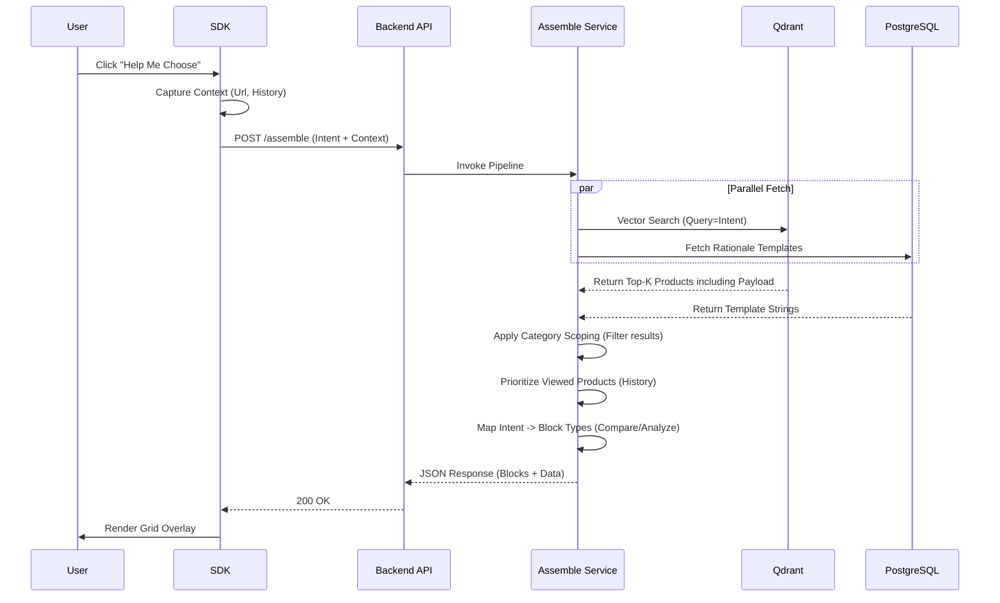

# DAP Highly Technical Architecture

## 1. System Architecture Overview
This document provides a deep technical breakdown of the Decision Assembly Platform (DAP). It details the interaction between the **Client-Side SDK** (embedded in customer sites) and the **Server-Side Agentic Platform**.

### High-Level Architecture Diagram (Mermaid)

```mermaid
graph TB
    subgraph "Client Side (Customer Website)"
        Host[Host Page DOM]
        
        subgraph "DAP SDK (Typescript/Rollup)"
            Loader[Loader.js]
            
            subgraph "Runtime Engine"
                EventManager[Event Telemetry<br/>(Scroll, Dwell, Hover)]
                TriggerEngine[Rule Engine<br/>(Friction Detection)]
                Store[Session State<br/>(Intent, History)]
            end
            
            subgraph "UI Layer (Shadow DOM)"
                Strip[Commentary Strip]
                Modal[Intent Selector]
                Grid[Decision Grid]
            end
        end
    end

    subgraph "DAP Backend (FastAPI/Python)"
        API[API Gateway<br/>(Uvicorn/FastAPI)]
        
        subgraph "Service Layer"
            Auth[Auth Service]
            Assemble[Assembler Service<br/>(RAG Pipeline)]
            Discovery[Discovery Agent<br/>(LangGraph + Crawl4AI)]
        end
        
        subgraph "AI & ML Layer"
            Embed[Embedding Model<br/>(all-MiniLM-L6-v2)]
            LLM[LLM Gateway<br/>(Ollama/OpenAI)]
        end
    end

    subgraph "Data Layer"
        PG[(PostgreSQL<br/>Config & Metadata)]
        Qdrant[(Qdrant<br/>Vector Store)]
    end

    %% Flows
    Host -->|Loads| Loader
    Loader -->|Init| API
    EventManager -->|Signals| TriggerEngine
    TriggerEngine -->|Updates| Strip
    Strip -->|User Action| Modal
    Modal -->|Select Intent| API
    
    API -->|Route| Assemble
    Assemble -->|Encode| Embed
    Embed -->|Vector| Qdrant
    Assemble -->|Fetch Rules| PG
    
    API -->|Route| Discovery
    Discovery -->|Crawl| Host
    Discovery -->|Analyze| LLM
    Discovery -->|Persist| PG
    Discovery -->|Index| Qdrant
```

---

## 2. Technical Component Breakdown

### A. The Client-Side SDK (`/sdk`)
The SDK is designed to be **lightweight (<15kb gzipped)** and **non-blocking**.

1.  **Loader (`loader.js`)**: 
    -   Entry point. Fetches `site_config` JSON from the CDN/API.
    -   Asynchronously loads the main runtime bundle.
    -   **Critical**: Fails silently if the backend is down; never breaks the host site.

2.  **Event Telemetry (`events.ts`)**:
    -   **Passive Listeners**: Attaches `scroll`, `mousemove` (throttled), and `click` listeners.
    -   **Heuristics**:
        -   *Dwell Time*: Tracks active time on specific types of pages (Product vs Listing).
        -   *Rage Clicks*: Detects rapid clicking (frustration signal).
        -   *Looping*: Detects if a user visits the same URL 3+ times in a session.

3.  **Trigger Engine (`triggers.ts`)**:
    -   **Local Evaluation**: Rules are evaluated **in-browser** (CPU efficient) to avoid API polling.
    -   **Logic**: `IF (ProductsViewed > 3 OR Dwell > 45s) THEN Show_Commentary()`.

4.  **UI Manager (Shadow DOM)**:
    -   All UI elements (Strip, Modal, Grid) are rendered inside a **Shadow Root**.
    -   **Why?** This provides strict CSS isolation, ensuring host site styles don't break the DAP UI, and DAP styles don't leak out.

---

### B. The Backend Services (`/backend`)
Built on **FastAPI** for high-concurrency `async` performance.

#### 1. The Real-Time Assembler (`assemble.py`)
The core RAG (Retrieval-Augmented Generation) pipeline.
*   **Latency Target**: < 200ms.
*   **Protocol**:
    1.  **Context Injection**: SDK sends `visited_urls`, `current_url`, `page_title`, and `selected_intent`.
    2.  **Category Scoping**: Backend strictly determines the category (e.g., "Cardiology") using the current page title + history.
    3.  **Vector Search**: 
        -   Query: `intent + page_title`.
        -   Filter: `site_id = X AND category = Y` (Strict filtering).
    4.  **Ranking (The "Gravity" Logic)**:
        -   **Priority 1 (History Lock)**: If the user visited specific pages in this section, force-include them.
        -   **Priority 2 (Visible Lock)**: If items are visible on the current page, include them.
        -   **Priority 3 (RAG Fallback)**: Semantic search finding "similar" items.
    5.  **Response**: Returns a JSON definition of Blocks (Comparison Table, Features, etc.).

#### 2. The Discovery Agent (`dag.py`)
An autonomous agent using **LangGraph** for site onboarding.
*   **Workflow**:
    1.  `node_crawl`: Uses **Crawl4AI** to render JS-heavy sites into Markdown.
    2.  `node_analyze`: Sends Markdown to **LLM** (GPT-4o/Ollama).
        -   *Prompt Strategy*: "Extract CSS selectors for Price, Title, and define 3 User Intents."
    3.  `node_save`: Writes config to Postgres and rationales to the template table.

---

### C. Data Layer

#### 1. PostgreSQL Schema
Stores relational data and configurations.
*   `sites`: Tenant details.
*   `site_config`: JSONB definitions of CSS selectors and rules.
*   `rationale_templates`: Templates like "Because you viewed {{product}}, this is a good alternative."

#### 2. Qdrant (Vector Database)
Stores semantic embeddings of the product catalog.
*   **Collection Strategy**: One collection per site (or shared with `site_id` filtering).
*   **Payload**: Stores raw metadata (`price`, `title`, `url`, `category`) alongside the vector to allow retrieval without a secondary DB lookup.

---

## 3. Sequence Diagram: The "Assemble" Flow

This diagram shows exactly what happens when a user asks for help.


